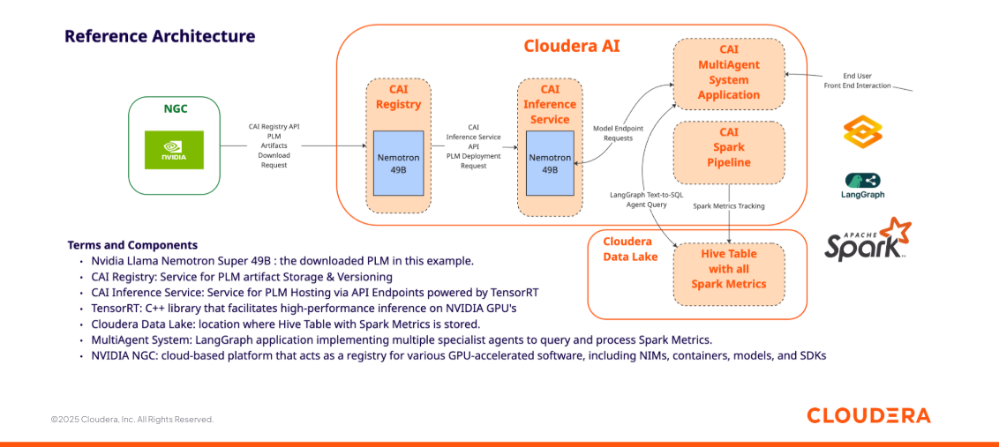

# CAI LangGraph Articles

Collection of demo/articles of Agentic AI using LangGraph in Cloudera AI. This page is continuously updated.

### How to Implement a Spark Observability MultiAgent System in CAI with Nvidia Nemotron 49B, Cloudera AI Inference Service and LangGraph

In this tutorial you will learn how to implement a MultiAgent System in Cloudera AI leveraging Nvidia Nemotron 49B, LangGraph, and the Cloudera AI Inference Service, in order to build a Spark Observability system.

Instructions & Code: https://github.com/pdefusco/cai_langgraph_agents_articles/tree/main/spark_observability_agent

