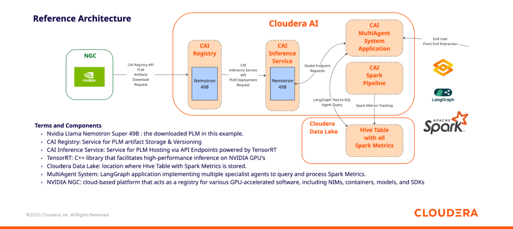
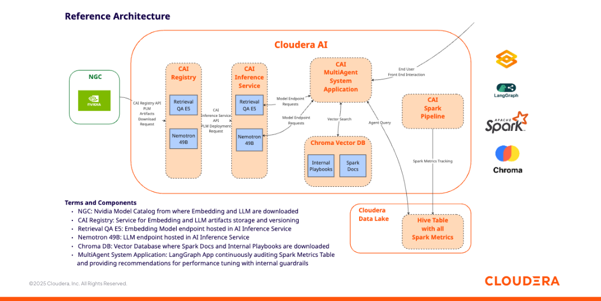
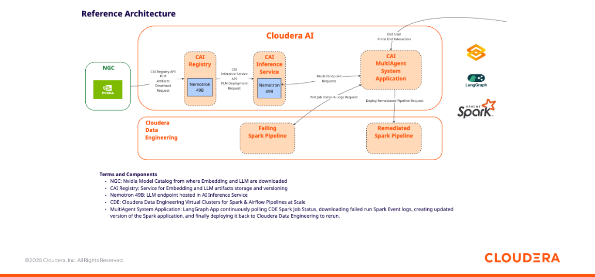
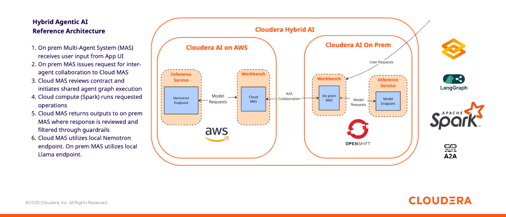
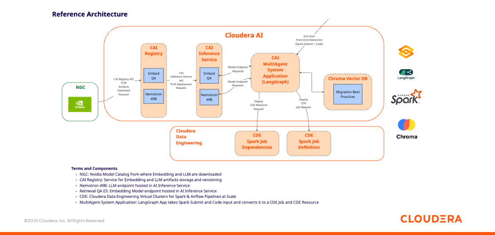
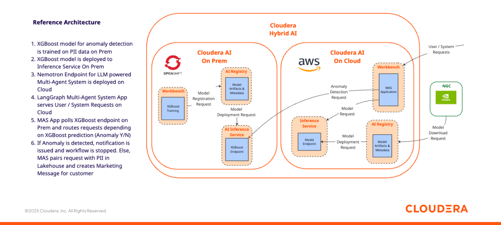

# CAI LangGraph Demo Articles

Collection of demos of Agentic AI using LangGraph in Cloudera AI. This page is continuously updated.

### How to Implement a Spark Observability MultiAgent System in CAI with Nvidia Nemotron 49B, Cloudera AI Inference Service and LangGraph

In this tutorial you will learn how to implement a MultiAgent System in Cloudera AI leveraging Nvidia Nemotron 49B, LangGraph, and the Cloudera AI Inference Service, in order to build a Spark Observability system.

This example was built with Cloudera On Cloud Public Cloud Runtime 7.3.1, CAI Workbench 2.0.53, Inference Service 1.8.0 and AI Registry 1.11.0.

Instructions & Code: https://github.com/pdefusco/cai_langgraph_agents_articles/tree/main/spark_observability_agent

### How to Implement a Spark Continuous Monitoring MultiAgent System in CAI with Chroma, Nvidia Nemotron 49B, Retrieval QA E5, Cloudera AI Inference Service and LangGraph

In this tutorial, you will implement a MultiAgent System to continuously monitor Spark pipelines, flag performance anomalies, query internal documentation, playbooks and best practices, and output a moderated tuning recommendation. You will build this in Cloudera AI leveraging Chroma, Nvidia Nemotron 49B, Retrieval QA E5, LangGraph, and the Cloudera AI Inference Service.

This example was built with Cloudera On Cloud Public Cloud Runtime 7.3.1, CAI Workbench 2.0.53, Inference Service 1.8.0 and AI Registry 1.11.0.

Instructions & Code: https://github.com/pdefusco/cai_langgraph_agents_articles/tree/main/spark_continuous_monitoring_agent#how-to-implement-a-spark-continuous-monitoring-multiagent-system-in-cai-with-chroma-nvidia-nemotron-49b-retrieval-qa-e5-cloudera-ai-inference-service-and-langgraph

### How to Implement a CDE Spark Self Healing Pipeline in CAI with LangGraph, Nvidia Nemotron 49B, and Cloudera AI Inference Service

In this tutorial, you will implement a MultiAgent System to continuously monitor a Spark Application running in Cloudera Data Engineering, correct any potential coding errors and finally create and run the updated version of the application. We will call this a "Self Healing Pipeline". You will build this MAS in Cloudera AI leveraging LangGraph, Nvidia Nemotron 49B, and the Cloudera AI Inference Service.

This example was built with Cloudera On Cloud Public Cloud Runtime 7.3.1, CAI Workbench 2.0.53, Inference Service 1.8.0 and AI Registry 1.11.0.

Instructions & Code: https://github.com/pdefusco/cai_langgraph_agents_articles/tree/main/spark_self_healing_pipeline_simple

### How to Implement a Hybrid Agent A2A Pipeline in CAI with LangGraph, Nvidia Nemotron 49B, and Cloudera AI Inference Service

In this tutorial, you will implement a Hybrid AI MultiAgent System across an on prem and an AWS instance of Cloudera AI in order to access remote data via a Text to SQL interface. The two agents will exchange a contract through the A2A protocol and share information among themselves in order to fulfill the user request.

This example was built with Cloudera On Cloud Public Cloud and Cloudera On Prem Private Cloud Runtime 7.3.1, CAI Workbench 2.0.53, Inference Service 1.8.0 and AI Registry 1.11.0.

Instructions & Code: https://github.com/pdefusco/cai_langgraph_agents_articles/tree/main/hybrid_agents_a2a

### How to Implement a Multi-Agent System to Migrate Spark Submits to Cloudera Data Engineering with LangGraph, Nvidia Nemotron 49B, and Cloudera AI Inference Service in Cloudera AI

In this tutorial, you will implement a Multi-Agent System to migrate a Spark Application to Cloudera Data Engineering. You will build this in Cloudera AI leveraging Chroma, Nvidia Nemotron 49B, Retrieval QA E5, LangGraph, and the Cloudera AI Inference Service.

This example was built with Cloudera On Cloud Public Cloud Runtime 7.3.1, CAI Workbench 2.0.53, Inference Service 1.8.0 and AI Registry 1.11.0.

Instructions & Code: https://github.com/pdefusco/cai_langgraph_agents_articles/tree/main/agentic_spark_migration_tool#how-to-implement-a-multi-agent-system-to-migrate-spark-submits-to-cloudera-data-engineering-with-langgraph-nvidia-nemotron-49b-and-cloudera-ai-inference-service-in-cloudera-ai

### How to Implement a Multi-Agent System with Machine Learning in Cloudera AI using Spark, XGBoost, LangGraph, Nemotron and Cloudera AI Inference Service, across Multiple Cloud Environments

In this tutorial, you will implement a Multi-Agent System leveraging a Machine Learning for request routing and processing. The MAS will accept structured or unstructured text requests, extract features, and poll an XGBoost classifier in order to decide if the incoming request is anomalous. If it is, the MAS is tasked with sending a notification. If it's not, the MAS tasks a specialized agent to retrieve PII from a customer table in the Lakehouse and create a marketing offer for the customer.

This example was built with Cloudera On Cloud Public Cloud Runtime 7.3.1, CAI Workbench 2.0.53, Inference Service 1.8.0 and AI Registry 1.11.0. In the Inference Service, an XGBoost and Nvidia Nemotron Super 49B endpoints were deployed ahead of time.

Instructions & Code: https://github.com/pdefusco/cai_langgraph_agents_articles/tree/main/mas_with_ml

