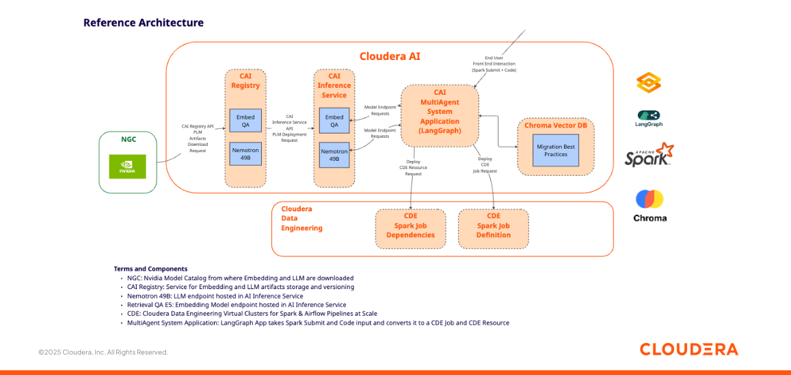
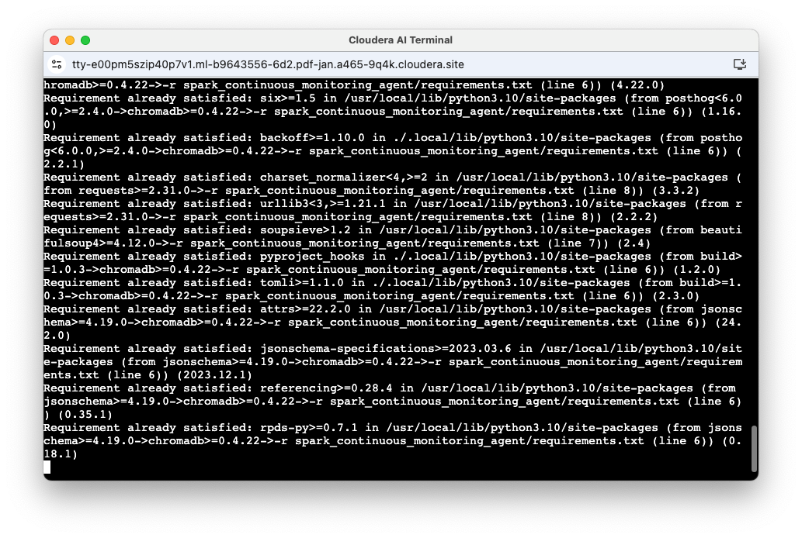
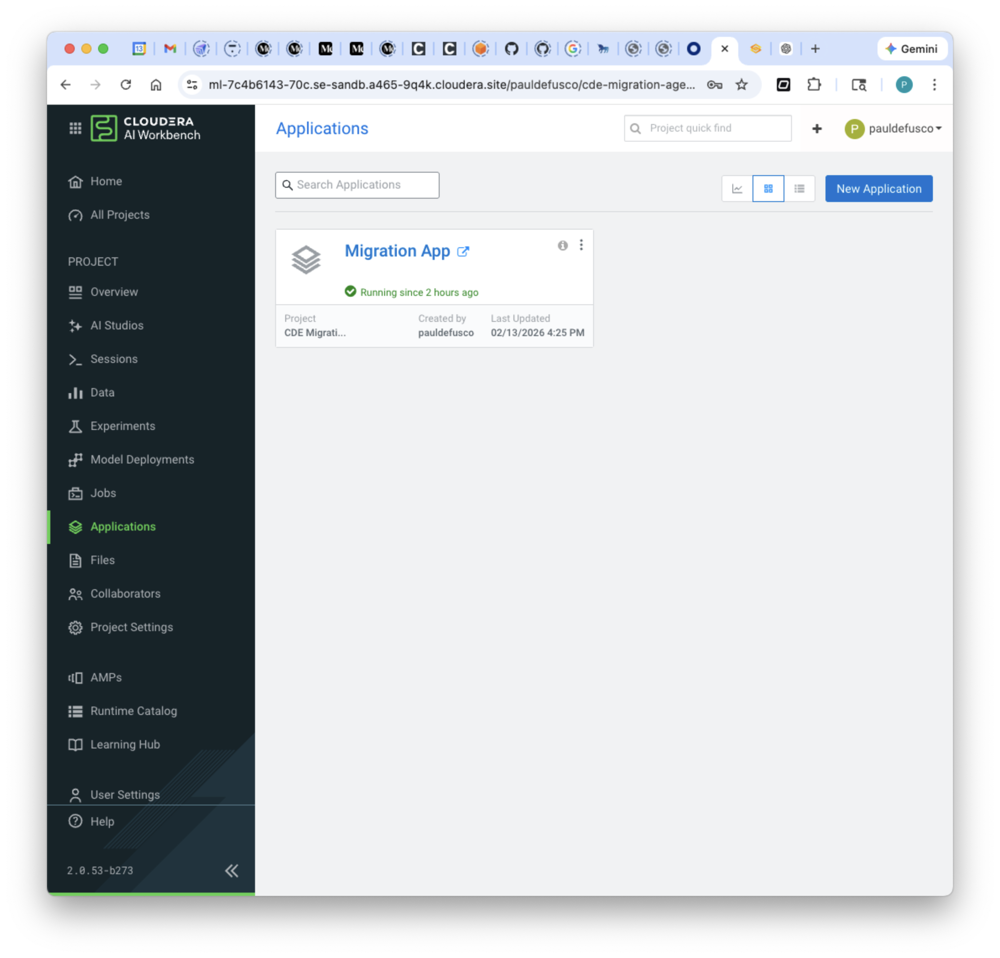
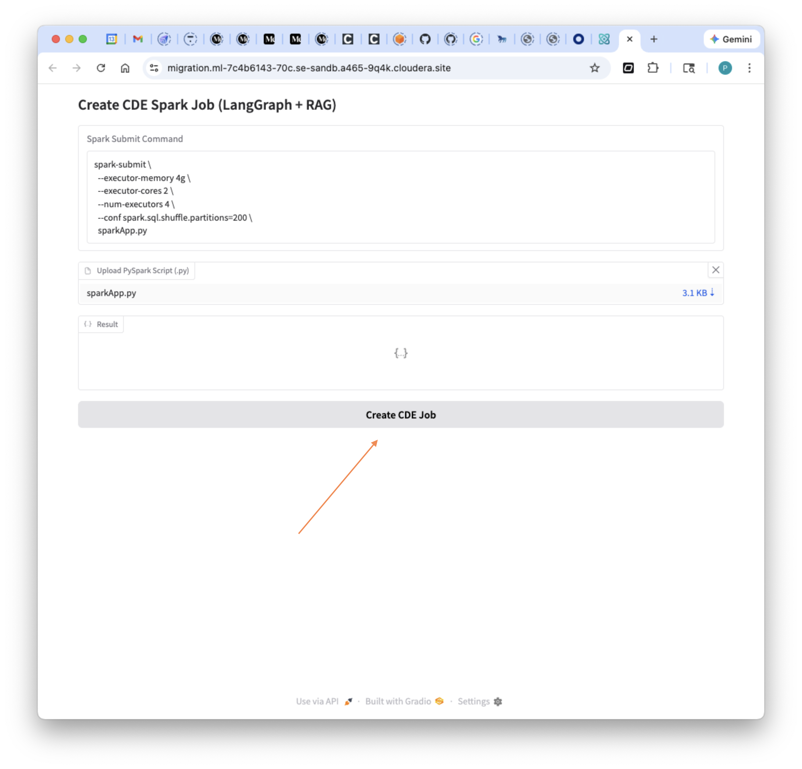
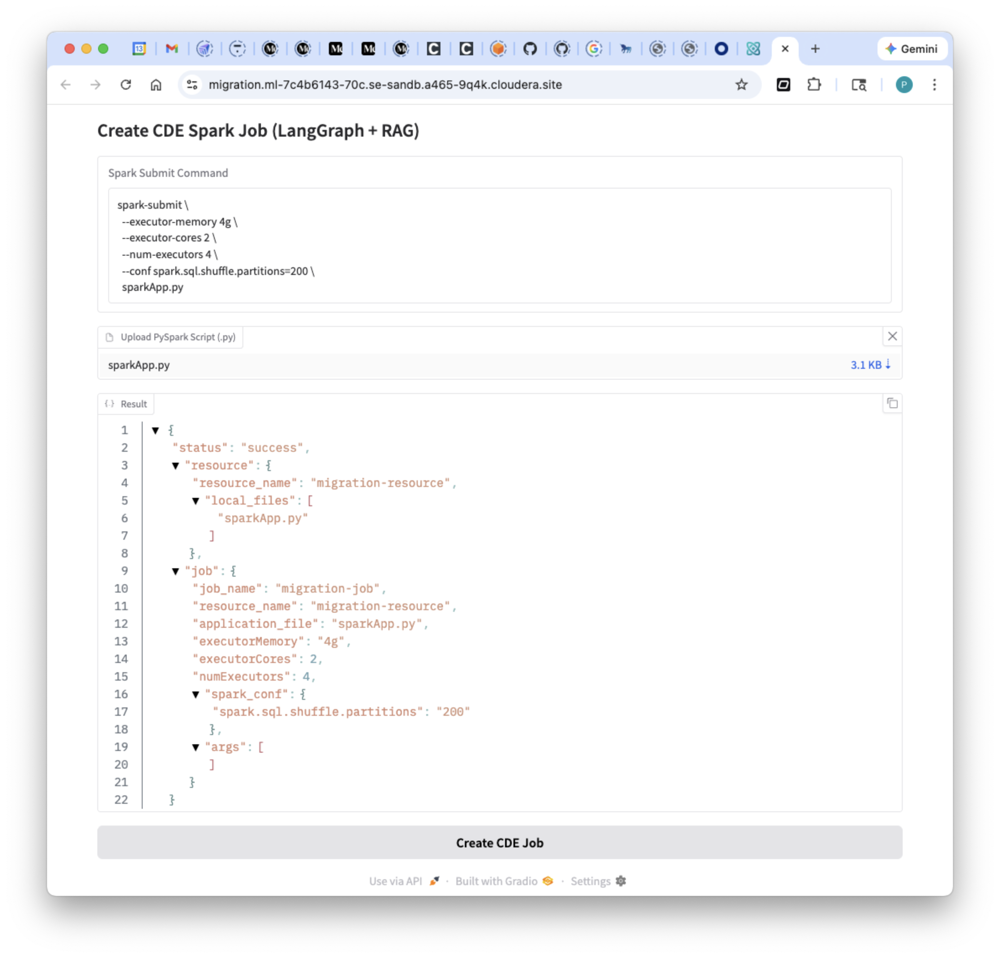
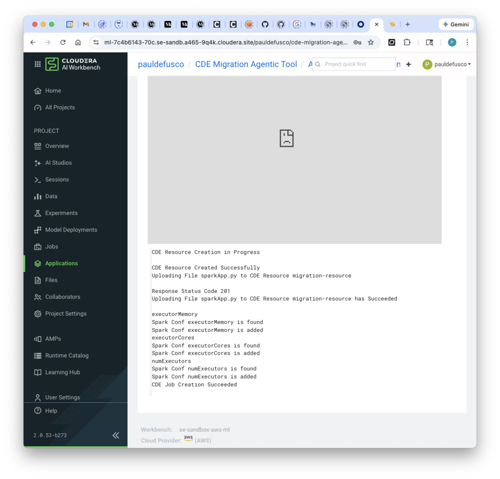
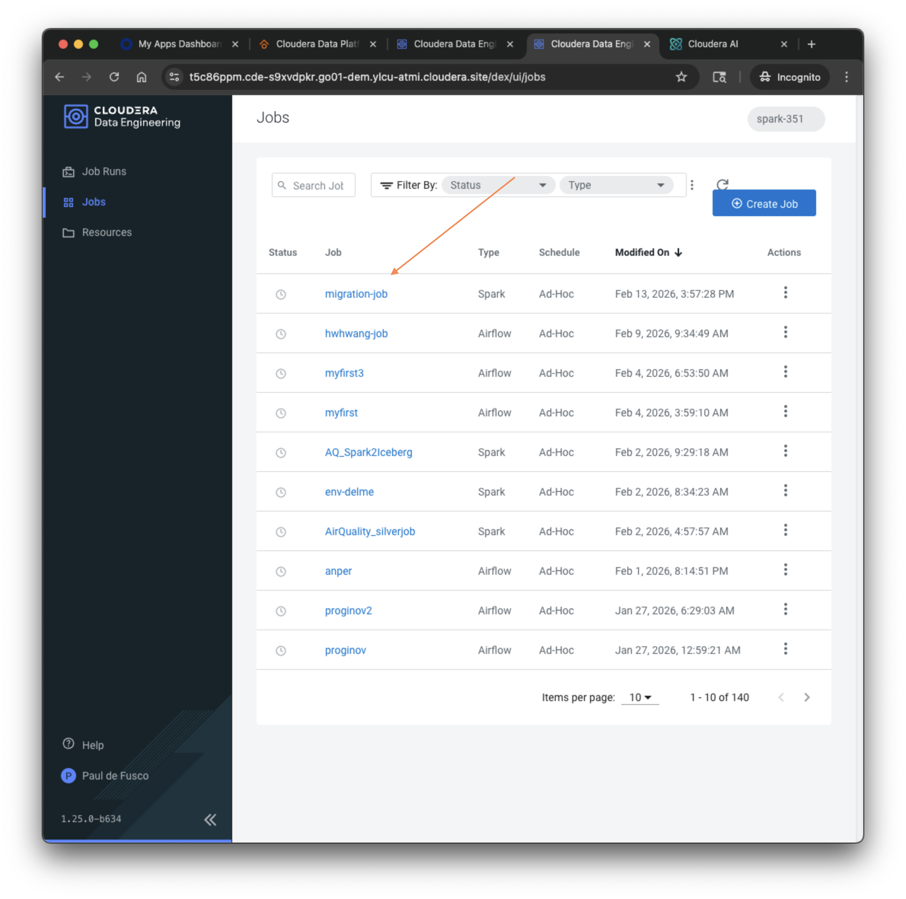
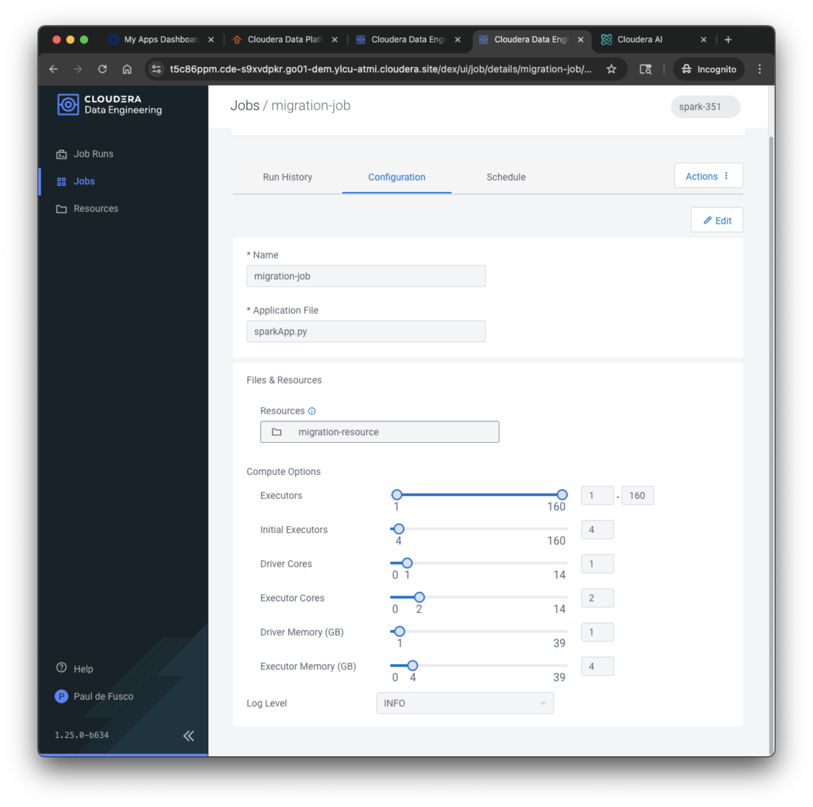
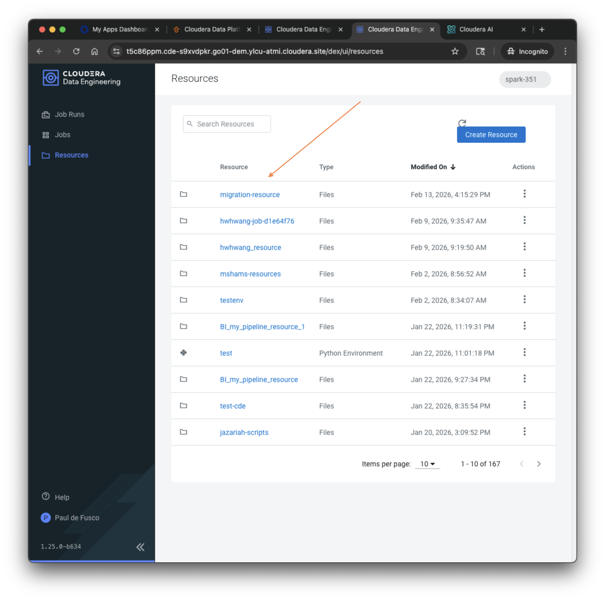
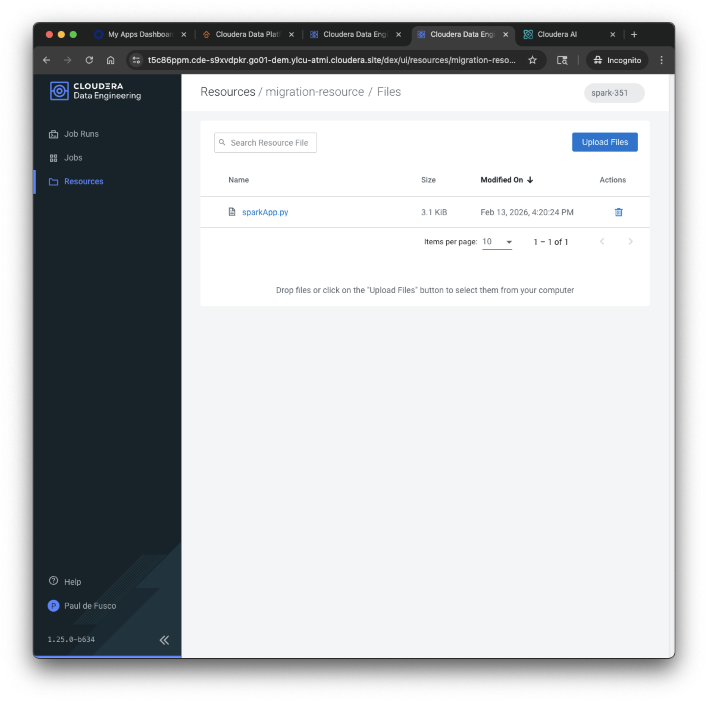

# How to Implement a Multi-Agent System to Migrate Spark Submits to Cloudera Data Engineering with LangGraph, Nvidia Nemotron 49B, and Cloudera AI Inference Service in Cloudera AI



## Objective

In this tutorial, you will implement a Multi-Agent System to migrate a Spark Application to Cloudera Data Engineering. You will build this in Cloudera AI leveraging Chroma, Nvidia Nemotron 49B, Retrieval QA E5, LangGraph, and the Cloudera AI Inference Service.

This prototype can be modified and extended to migrate Spark applications in bulk, provide private business context, or even adapted to different compute engines.

### Motivation

Enteprises running Cloudera AI can download open source GenAI models and securely host them in their Public or Private Cloud, in order to implement LLM-powered applications while preventing proprietary information from being shared with LLM Service Providers such as OpenAI. We call this Private AI.

Cloudera customers are increasingly applying the idea of Private AI to manage and scale data engineering pipelines, and this project embodies yet another example of this.

In Cloudera Data Engineering, the CDE Spark Job is a reusable definition of a Spark Application consisting of its code, and file, Docker, and Python dependencies, and Spark configurations and options. Unlike a Spark Submit, a CDE Spark Job acts as an overridable template for future executions.

The most important benefit of this is that data engineers are not challenged by having to manage multitudes of bash scripts, logs, API calls, Notebook servers, and private credentials, all on edge nodes - but can safely and effectively track and store code and related depencies in CDE Virtual Clusters. Within organizations managing hundreds or even thousands of Spark applications, this can really make a difference!

Building CDE Job Definitions is easy, but from time to time requires adapting a few parameters. This prototype leverages Agents to bridge this gap. The MAS is tasked with consulting an internal spark migration playbook, indexed in a vector database, in order to map Spark Submits to CDE Job Definitions. Using the App's UI, data engineers can upload their PySpark scripts and create the corresponding CDE Job in their CDE Virtual Cluster of choice, at the push of a button.

### Cloudera AI & LLM's

Cloudera AI (CAI) is a platform that enables organizations to build, train, and deploy machine learning and artificial intelligence models at scale. One of its key features is the Cloudera AI Inference Service, which allows users to easily deploy large language models (LLMs) for real-time or batch inference. With Cloudera AI, data scientists and engineers can manage and serve LLMs like Llama, Mistral, or open-source GPT models using containerized environments and scalable infrastructure. This service supports secure, low-latency model serving, making it easier to integrate AI into enterprise applications.

### Cloudera Data Engineering

Cloudera Data Engineering is a cloud-native service designed to simplify the development, deployment, and scaling of data pipelines. Built on the open data lakehouse architecture of Cloudera Data Platform (CDP), it enables engineers to run Apache Spark workloads with automated resource management, security, and governance. The platform supports batch and streaming data processing, integrates with popular analytics and machine learning tools, and helps organizations accelerate data transformation while maintaining enterprise-grade reliability and compliance.

## Requirements

This example was built with Cloudera On Cloud Public Cloud Runtime 7.3.1, CAI Workbench 2.0.53, Inference Service 1.8.0 and AI Registry 1.11.0.

You can reproduce this tutorial in your CAI environment with the following:

* A CDE Service and Virtual Cluster in Private or Public Cloud.
* A CAI Environment in Private or Public Cloud.
* An AI Registry deployment.
* An AI Inference Service deployment with Nemotron (or another LLM) and Retrieval QA E5 (or another Embedding model) deployed as two different endpoints.

This tutorial does not includes instructions to deploy the AI Registry, Inference Service and Nemotron endpoint. For deployment examples, please visit [this repository](https://github.com/pdefusco/CAI_Inf_Service_Articles/tree/main) where you can find projects based on [Nvidia NIMs](https://github.com/pdefusco/CAI_Inf_Service_Articles/tree/main/mixtral-ngc), [HuggingFace Catalog](https://github.com/pdefusco/CAI_Inf_Service_Articles/tree/main/llama-hf), and [LangGraph](https://github.com/pdefusco/CAI_Inf_Service_Articles/tree/main/langgraph-agent).

### Tutorial

All artifacts are included in this Git repository. You can clone or fork it as needed. https://github.com/pdefusco/cai_langgraph_agents_articles.git

#### 1. Clone the Git Repository as a CAI Project

Create a project with the following entries:

```
Project Name: Multi-Agent System for Spark Migration
Project Description: Project to implement a Multi-Agent System to Migrate Spark Submits to CDE.
Initial Setup: -> GIT -> HTTPS -> https://github.com/pdefusco/cai_langgraph_agents_articles.git
Runtimes:
  PBJ Workbench	Python 3.10	Standard 2025.09 or later
```

#### 2. Create the Project Environment Variables

Navigate to the AI Inference Service UI and open the model endpoint. Then, copy the Model ID, Endpoint URL and CDP Token to your clipboard.

In the CAI Project Settings, create the following Environment Variables using the values copied above.

```
LLM_MODEL_ID: Enter the Model ID for Nemotron from the Inference Service UI
LLM_ENDPOINT_BASE_URL: Enter the Endpoint URL for Nemotron from the Inference Service UI
LLM_CDP_TOKEN: Enter the CDP Token for Nemotron from the Inference Service UI

EMBEDDING_MODEL_ID: Enter the Model ID for the Embedding Model from the Inference Service UI e.g. nvidia/nv-embedqa-e5-v5
EMBEDDING_ENDPOINT_BASE_URL: Enter the Endpoint URL for the Embedding Model from the Inference Service UI e.g. https://ml-12345678910.cloudera.site/namespaces/serving-default/endpoints/goes---e5-embedding/v1
EMBEDDING_CDP_TOKEN: Enter the CDP Token for the Embedding Model from the Inference Service UI

JOB_NAME: migration-job - or name of the CDE Job as you would like it to appear in the CDE UI
RESOURCE_NAME: migration-resource - or name of the CDE Resource as you would like it to appear in the CDE UI

JOBS_API_URL: Your CDE Virtual Cluster's URL Endpoint - this can be obtained from the CDE Cluster Details page
WORKLOAD_USER: Your CDP Workload Username
WORKLOAD_PASSWORD: Your CDP Workgload Password
```

Your Environment Variables section should look something like this.


#### 3. Launch the CAI Session and Install Requirements

Launch your first CAI Session with PBJ Runtime. You won't need a lot of resources:

```
Kernel: PBJ Workbench	Python 3.10	Standard 2025.09
Spark Runtime Addon: Spark 3.5.1
Resource Profile: 2 vCPU / 8 iGB Mem / 0 GPU
```


First, install the requirements by opening the Terminal and running this command:

```
pip3 install -r spark_continuous_monitoring_agent/requirements.txt
```



#### 4. Create and Launch the MAS Application

Navigate to the Applications page and create a new App with the following configurations:

```
Name: Migration App
Subdomain: migration
Script: agentic_spark_migration_tool/migrationApp.py
Editor: PBJ Runtime
Edition: Standard
Version: 2026.01 or later
vCPU/Memory GiB: 2 vCPU / 8 GiB
```



#### 5. Open the UI and Migrate your Spark Submit

Using the Gradio UI, paste the following Spark Submit command into the "Spark Submit Command" box:

```
spark-submit \
  --executor-memory 4g \
  --executor-cores 2 \
  --num-executors 4 \
  --conf spark.sql.shuffle.partitions=200 \
  sparkApp.py
```

Download the "sparkApp.py" script located in the "agentic_spark_migration_tool" folder to your local machine. Using the "Upload PySpark Script" box, select the "sparkApp.py" script from this github repository. Then click on "Create CDE Job".





Open the App backend logs and confirm execution of the MAS:



Finally, navigate to the CDE UI and validate job and resource creation.









## Summary & Next Steps

This demo consisted of a Multi-Agent System to migrate Spark Submits to Cloudera Data Engineering jobs. The prototype can be extended to include broader use cases (e.g. Spark Scala jobs), bulk uploads, guardrails, or even a broader set of internal migration best practices. You built this in Cloudera AI leveraging Chroma, Nvidia Nemotron 49B, Retrieval QA E5, LangGraph, and the Cloudera AI Inference Service.

**Additional Resources & Tutorials**

Explore these helpful tutorials and blogs to learn more about Cloudera AI, the AI Registry, and AI Inference Service:

1. **Cloudera AI Inference Service – Easy Integration & Deployment**
   A technical deep dive into how Cloudera’s inference service enables GenAI integration in production: ([Reddit][1], [Cloudera][2])

2. **Deploy & Scale AI Applications with Cloudera AI Inference Service**
   Official Cloudera blog covering general availability, hybrid support, and GPU acceleration: ([Cloudera][3])

3. **Cloudera Introduces AI Inference Service With NVIDIA NIM**
   Explains how NVIDIA NIM microservices are embedded, + details on AI Registry integration: ([Cloudera][4])

4. **Scaling AI Solutions with Cloudera: Inference & Solution Patterns**
   A deep technical walkthrough on deploying AI at scale, including RAG workflows with LLaMA models: ([Cloudera][5], [Reddit][6])

5. **How to Use Model Registry on Cloudera Machine Learning**
   Community guide focused specifically on registering, versioning, and managing models: ([community.cloudera.com][7])

6. **Cloudera AI Inference Service Overview (docs)**
   Official documentation outlining architecture, APIs (OpenAI & standard protocols), GPU support, and registry integration: ([Cloudera][2])

[1]: https://www.reddit.com/r/LlamaIndex/comments/1f4nqvc?utm_source=chatgpt.com "[Tutorial] Building Multi AI Agent System Using LlamaIndex and Crew AI!"
[2]: https://www.cloudera.com/blog/technical/cloudera-ai-inference-service-enables-easy-integration-and-deployment-of-genai.html?utm_source=chatgpt.com "Elevating Productivity: Cloudera Data Engineering Brings External IDE Connectivity to Apache Spark | Blog | Cloudera"
[3]: https://www.cloudera.com/blog/business/deploy-and-scale-ai-applications-with-cloudera-ai-inference-service.html?utm_source=chatgpt.com "Deploy and Scale AI Applications With Cloudera AI Inference Service | Blog | Cloudera"
[4]: https://cloudera.com/blog/business/cloudera-introduces-ai-inference-service-with-nvidia-nim.html?utm_source=chatgpt.com "Cloudera Introduces AI Inference Service With NVIDIA NIM | Blog | Cloudera"
[5]: https://www.cloudera.com/blog/technical/scaling-ai-solutions-with-cloudera-a-deep-dive-into-ai-inference-and-solution-patterns.html?utm_source=chatgpt.com "Scaling AI Solutions with Cloudera: A Deep Dive into AI Inference and Solution Patterns | Blog | Cloudera"
[6]: https://www.reddit.com/r/learnmachinelearning/comments/1cn1c3u?utm_source=chatgpt.com "Fine-tune your first large language model (LLM) with LoRA, llama.cpp, and KitOps in 5 easy steps"
[7]: https://community.cloudera.com/t5/Community-Articles/How-to-use-Model-Registry-on-Cloudera-Machine-Learning/ta-p/379812?utm_source=chatgpt.com "How to use Model Registry on Cloudera Machine Lear... - Cloudera Community - 379812"
