# How to Implement a Hybrid Agent A2A Pipeline in CAI with LangGraph, Nvidia Nemotron 49B, and Cloudera AI Inference Service

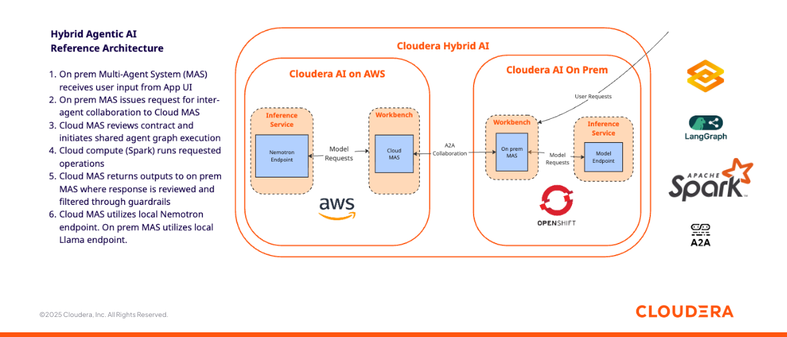

## Objective

In this tutorial, you will implement a Hybrid AI MultiAgent System across an on prem and an AWS instance of Cloudera AI in order to access remote data via a Text to SQL interface. The two agents will exchange a contract through the A2A protocol and share information among themselves in order to fulfill the user request.

You will build this MAS in Cloudera AI leveraging LangGraph, Nvidia Nemotron 49B, and the Cloudera AI Inference Service.

This tutorial can serve as a reusable template to build MultiAgent Systems across public and private clouds via the A2A protocol.

### Motivation

Enterprises increasingly operate across hybrid and multi-cloud environments, where sensitive data and specialized AI services are distributed across locations. Agent-to-Agent (A2A) collaboration enables these systems to communicate, negotiate contracts, and exchange information securely, ensuring that each agent only accesses resources it is authorized for. This creates a scalable, auditable framework for AI workflows that respects governance and reduces operational risk.

In a Text-to-SQL scenario such as the one outlined in this demonstration, A2A allows an on prem-based AI agent to request access to a cloud data source, receive a formal contract specifying permitted tables, and return query results without ever exposing unauthorized data. This demonstrates how A2A can enforce data access policies while enabling natural language analytics across hybrid systems.

With Cloudera AI, enterprises can download open source GenAI models and securely host them in their Public and/or Private Clouds - simultaneously - in order to implement LLM-powered A2A applications while preventing proprietary information from being shared with LLM Service Providers such as OpenAI.

### Cloudera AI & LLM's

Cloudera AI (CAI) is a platform that enables organizations to build, train, and deploy machine learning and artificial intelligence models at scale. One of its key features is the Cloudera AI Inference Service, which allows users to easily deploy large language models (LLMs) for real-time or batch inference. With Cloudera AI, data scientists and engineers can manage and serve LLMs like Llama, Mistral, or open-source GPT models using containerized environments and scalable infrastructure. This service supports secure, low-latency model serving, making it easier to integrate AI into enterprise applications.

## Requirements

This example was built with Cloudera On Cloud Public Cloud Runtime 7.3.1, CAI Workbench 2.0.53, Inference Service 1.8.0 and AI Registry 1.11.0.

You can reproduce this tutorial in your CAI environment with the following:

* Two CAI Environments, preferably one in Private and one in Public Cloud.
* An AI Registry deployment for each environment.
* An AI Inference Service deployment in each environment, with Nemotron (or another LLM that lends itself to a Text to SQL use case) deployed as model endpoint in each environment.

This tutorial does not includes instructions to deploy the AI Registry, Inference Service and Nemotron endpoint. For deployment examples, please visit [this repository](https://github.com/pdefusco/CAI_Inf_Service_Articles/tree/main) where you can find projects based on [Nvidia NIMs](https://github.com/pdefusco/CAI_Inf_Service_Articles/tree/main/mixtral-ngc), [HuggingFace Catalog](https://github.com/pdefusco/CAI_Inf_Service_Articles/tree/main/llama-hf), and [LangGraph](https://github.com/pdefusco/CAI_Inf_Service_Articles/tree/main/langgraph-agent).

## Useful Documentation Links

* How to deploy a Workbench in Cloudera AI: https://docs.cloudera.com/machine-learning/1.5.5/workspaces-privatecloud/topics/ml-pvc-provision-ml-workspace.html
* How to deploy an AI Registry in Cloudera AI: https://docs.cloudera.com/machine-learning/1.5.5/setup-model-registry/topics/ml-setting-up-model-registry.html
* How to deploy an AI Inference Service in Cloudera AI: https://docs.cloudera.com/machine-learning/1.5.5/setup-cloudera-ai-inference/topics/ml-caii-use-caii.html

### Demonstration

All artifacts are included in this Git repository. You can clone or fork it as needed. https://github.com/pdefusco/cai_langgraph_agents_articles.git

### AWS Environment Setups

#### 1. Clone the Git Repository as a CAI Project in the AWS Environment

Create a project with the following entries:

```
Project Name: Cloud Application
Project Description: Project to implement a Hybrid A2A MultiAgent System to retrieve remote data sources.
Initial Setup: -> GIT -> HTTPS -> https://github.com/pdefusco/cai_langgraph_agents_articles.git
Runtimes:
  PBJ Workbench	Python 3.10	Standard 2025.09
```

#### 2. Create the Project Environment Variables with Secrets in the AWS Environment

Ppen the "Project Settings" -> "Advanced" tabs and set the following variables:

```
CLOUD_MODEL_ID: Enter the Model ID for Nemotron from the AWS Cloud Inference Service UI
CLOUD_MODEL_ENDPOINT: Enter the Endpoint URL for Nemotron from the AWS Cloud Inference Service UI
CLOUD_MODEL_KEY: Enter the CDP Token for Nemotron from the AWS Cloud Inference Service UI
```

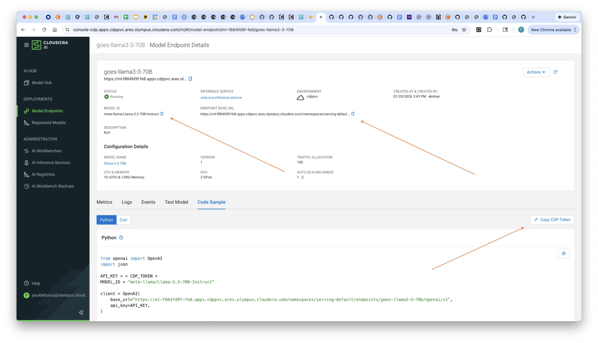

Your environment variables tab should look something like this:

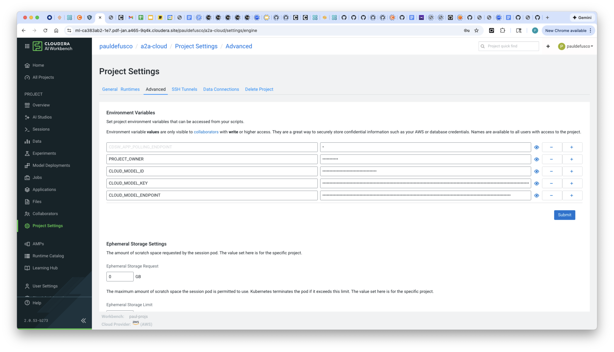

#### 3. Launch a CAI Session and Install Requirements in the On Prem Environment

Launch your first CAI Session with PBJ Runtime. You won't need a lot of resources:

```
Kernel: PBJ Workbench	Python 3.10	Standard 2025.09
Spark Runtime Addon: Spark 3.5.1
Resource Profile: 2 vCPU / 8 iGB Mem / 0 GPU
```

First, install the requirements by opening the Terminal and running this command:

```
pip3 install -r hybrid_agents_a2a/requirements.txt
```

#### 4. Run Hive External Table DDL Script

In the CAI Session, open script ```cloud_datagen.py``` and update line 167 according to your environment's Spark Data Connection name. Then run the code as is. When this is finished, update line 192 to "TableTest" and rerun the script.

This will ultimately create two tables, ```DataLakeEtl``` and ```TableTest```.

#### 5. Deploy the Gradio LangGraph MAS as a CAI Application

Navigate to Applications and launch the Gradio LangGraph App with the following settings.

```
Name: Cloud A2A App
Kernel: PBJ Workbench	Python 3.10	Standard 2025.09
Spark Runtime Addon: Spark 3.5.1
Resource Profile: 2 vCPU / 8 iGB Mem / 0 GPU
Script: hybrid_agents_a2a/cloud_app.py
Allow Unauthenticated Access: Leave unchecked
```

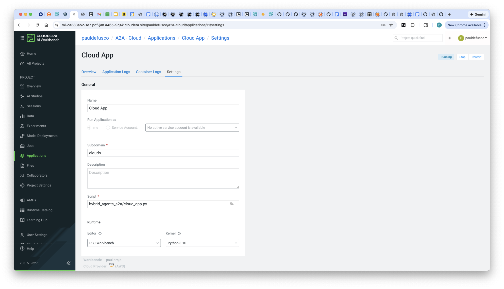

Validate the applicaton has deployed successfully.

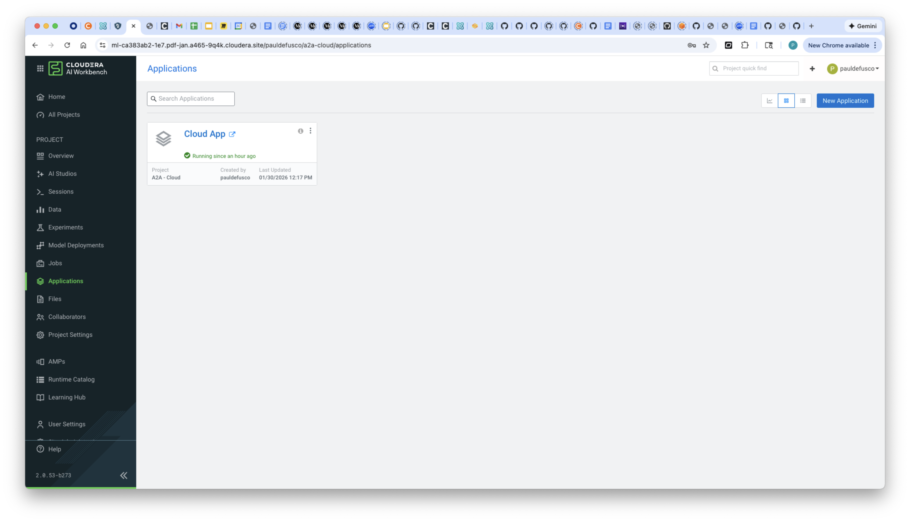


### On Prem Environment Setups

#### 1. Clone the Git Repository as a CAI Project in the On Prem Environment

Create a project with the following entries:

```
Project Name: On Prem Application
Project Description: Project to implement a Hybrid A2A MultiAgent System to retrieve remote data sources.
Initial Setup: -> GIT -> HTTPS -> https://github.com/pdefusco/cai_langgraph_agents_articles.git
Runtimes:
  PBJ Workbench	Python 3.10	Standard 2025.09
```

#### 2. Create the Project Environment Variables with Secrets in the On Prem Environment

Navigate to the AI Inference Service UI and open the model endpoint. Then, copy the Model ID, Endpoint URL and CDP Token to your clipboard.

In the CAI Project Settings, create the following Environment Variables using the values copied above.

```
ON_PREM_MODEL_ID: Enter the Model ID for Nemotron from the On Prem Inference Service UI
ON_PREM_MODEL_ENDPOINT: Enter the Endpoint URL for Nemotron from the On Prem Inference Service UI
ON_PREM_MODEL_KEY: Enter the CDP Token for Nemotron from the On Prem Inference Service UI

CLOUD_AGENT_URL: Enter the Application URL as provided in the Cloud Application by opening the application and copying the url from the browser e.g. https://clouds.ml-ca383ab2-1e7.pdf-jan.a465-9q4k.cloudera.site/
CLOUD_AGENT_ACCESS_KEY: Optional - Leave blank if you don't have one
CLOUD_AGENT_API_KEY: Create and enter API Key with Application Permissions in the Cloud Workbench User Settings Tab
```

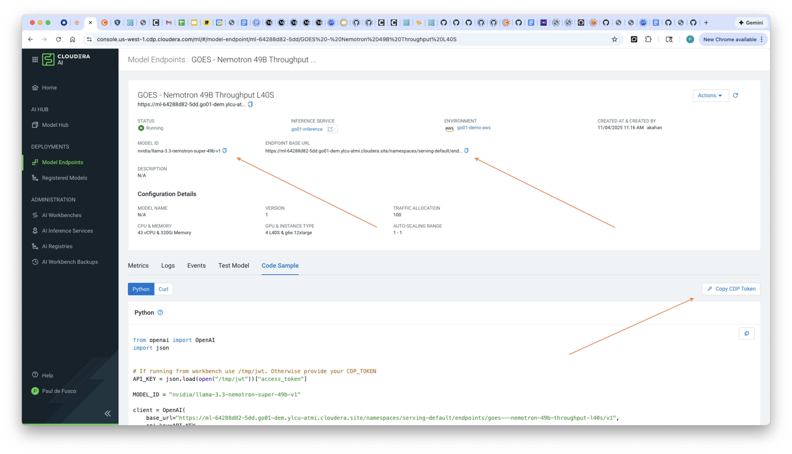

Your environment variables tab should look something like this:

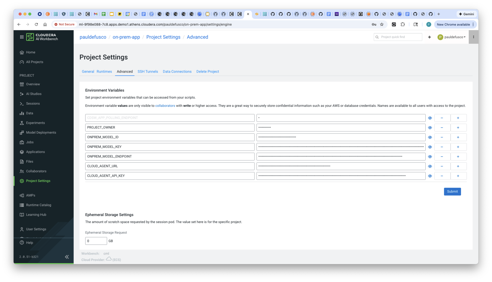

#### 3. Launch a CAI Session and Install Requirements in the On Prem Environment

Launch your first CAI Session with PBJ Runtime. You won't need a lot of resources:

```
Kernel: PBJ Workbench	Python 3.10	Standard 2025.09
Spark Runtime Addon: Spark 3.5.1
Resource Profile: 2 vCPU / 8 iGB Mem / 0 GPU
```

First, install the requirements by opening the Terminal and running this command:

```
pip3 install -r hybrid_agents_a2a/requirements.txt
```

#### 4. Deploy the Gradio LangGraph MAS as a CAI Application in the On Prem Environment

Navigate to Applications and launch the Gradio LangGraph App with the following settings.

```
Name: On Prem A2A App
Kernel: PBJ Workbench	Python 3.10	Standard 2025.09
Spark Runtime Addon: Spark 3.5.1
Resource Profile: 2 vCPU / 8 iGB Mem / 0 GPU
Script: hybrid_agents_a2a/onprem_app.py
Allow Unauthenticated Access: Leave unchecked
```

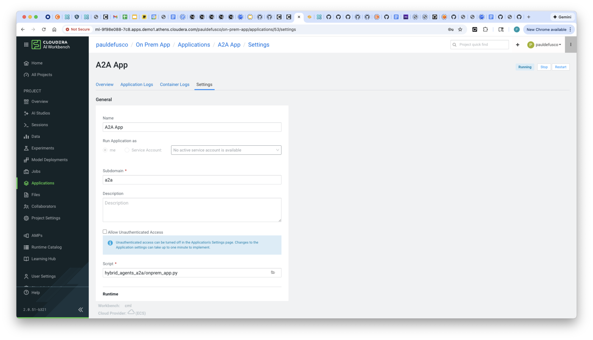

Validate the applicaton has deployed successfully.

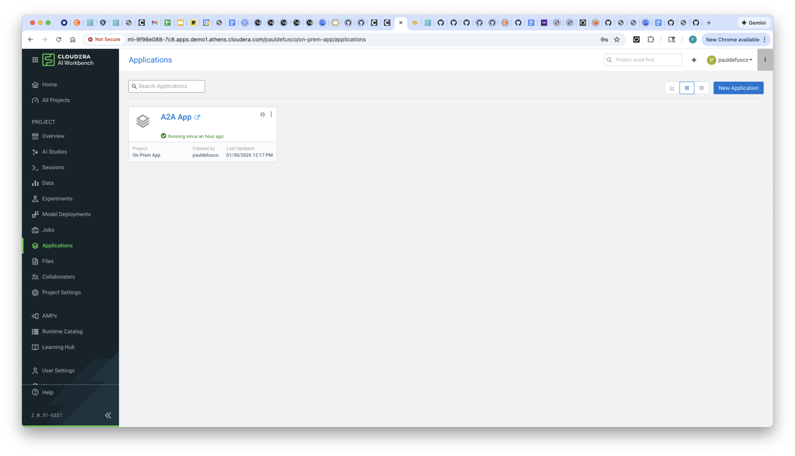


### Interact with the Agent App

In the on prem instance open the Application and enter the query ```How many rows in the TableTest table?```. Notice in the output that access is denied. The contract between the two agents excluded the TableTest table from the set of accessible tables.

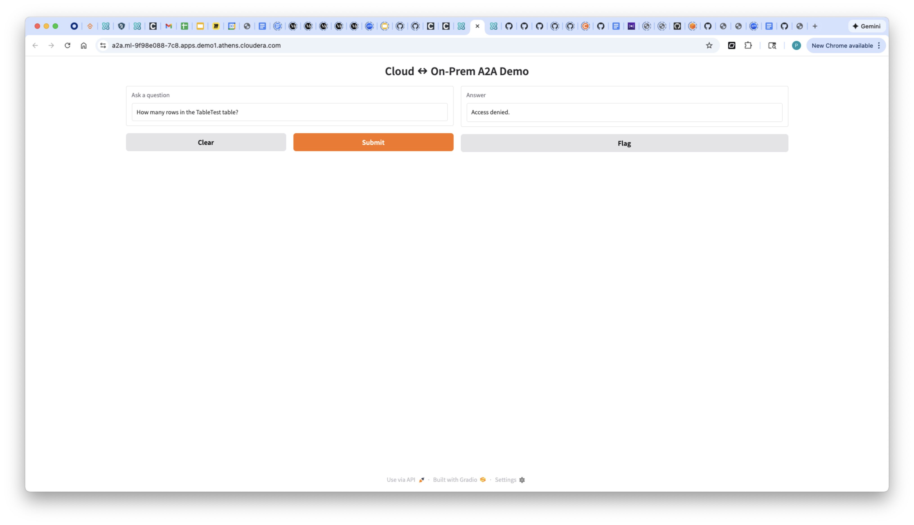

Next, run the query ```How many rows in the DataLakeEtl table?```. Notice this time the query result is shown in the UI. This is because access to the table has been granted by the contract between the two agents.

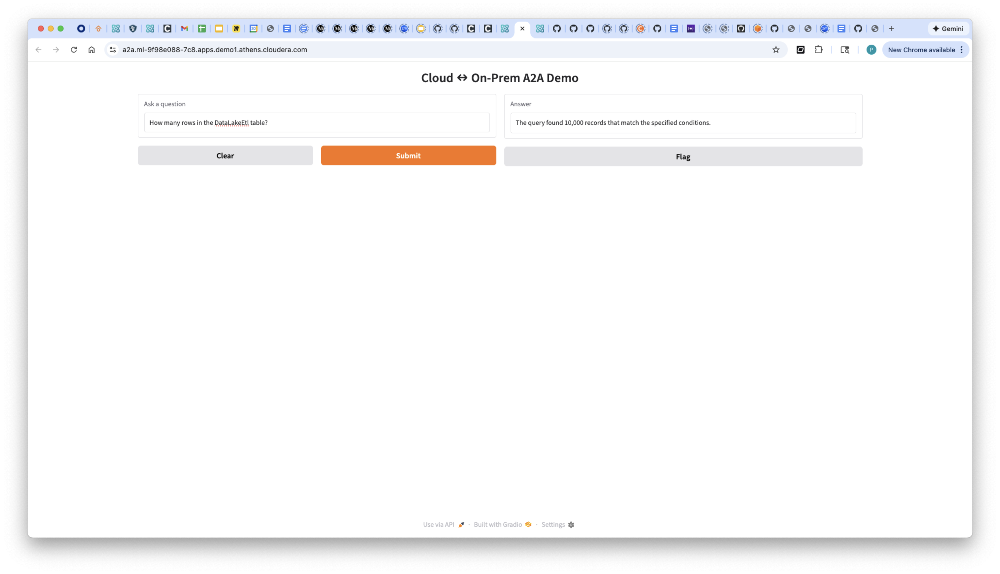


To investigate the workflow, open the on prem application logs and explore the python code outputs. The on prem multi-agent system sent a request requesting A2A contract approval to the cloud app where the local multi-agent system leveraged Spark SQL to execute the query. Along the way, the text input was transformed into a SQL query, run as a Spark SQL job, and finally returned to the on prem agent where additional security guardrails were applied to validate the output.

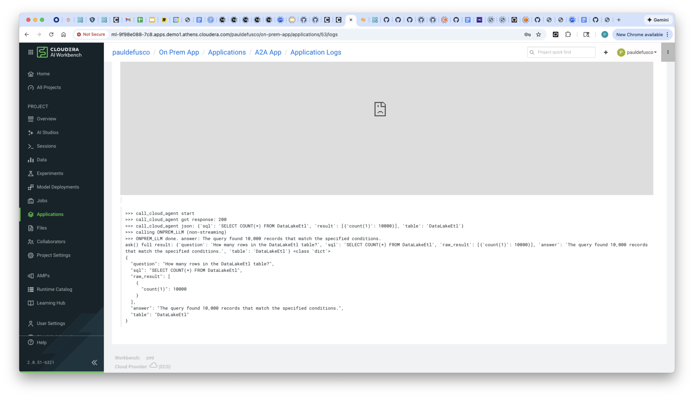

Open the cloud application logs and explore the python code outputs. The logs confirm that a request with an A2A contract request was received and approved and that the Spark SQL compute took place here.

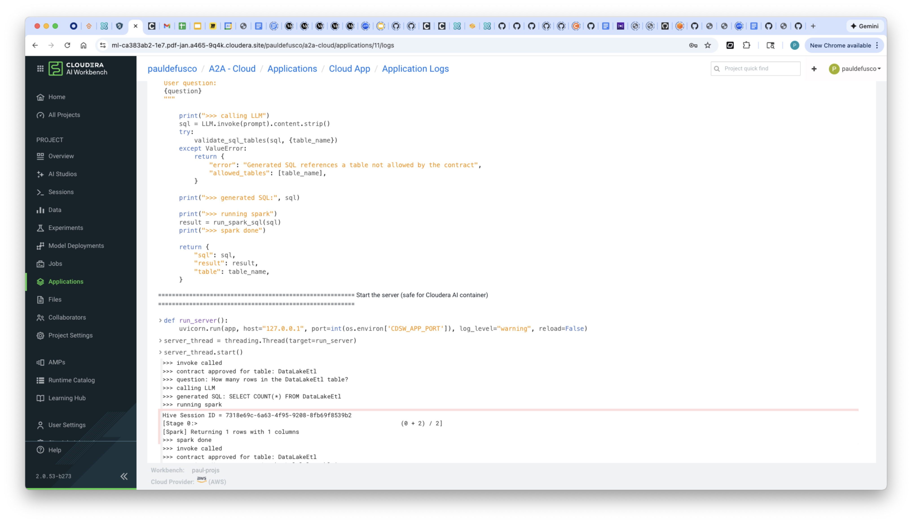


## Summary & Next Steps

This demo showcased a hybrid AI multi-agent system operating across on premises and cloud environments. The on prem and cloud agents communicated via the Agent-to-Agent (A2A) protocol, exchanging a formal contract that defined authorized data access. Using this framework, the system safely executed user requests while enforcing governance and security policies.

In this Text to SQL scenario, the cloud agent generated queries for the approved table, the on prem agent executed them, and the results were returned in natural language, demonstrating how A2A enables secure, collaborative AI workflows across hybrid infrastructures.

You built this in Cloudera AI leveraging two Nvidia Nemotron 49B endpoints, LangGraph, and the Cloudera AI Inference Service. This tutorial can serve as a reusable template for use cases leveraging A2A across environments.

**Additional Resources & Tutorials**

Explore these helpful tutorials and blogs to learn more about Cloudera AI, the AI Registry, and AI Inference Service:

1. **Cloudera AI Inference Service – Easy Integration & Deployment**
   A technical deep dive into how Cloudera’s inference service enables GenAI integration in production: ([Reddit][1], [Cloudera][2])

2. **Deploy & Scale AI Applications with Cloudera AI Inference Service**
   Official Cloudera blog covering general availability, hybrid support, and GPU acceleration: ([Cloudera][3])

3. **Cloudera Introduces AI Inference Service With NVIDIA NIM**
   Explains how NVIDIA NIM microservices are embedded, + details on AI Registry integration: ([Cloudera][4])

4. **Scaling AI Solutions with Cloudera: Inference & Solution Patterns**
   A deep technical walkthrough on deploying AI at scale, including RAG workflows with LLaMA models: ([Cloudera][5], [Reddit][6])

5. **How to Use Model Registry on Cloudera Machine Learning**
   Community guide focused specifically on registering, versioning, and managing models: ([community.cloudera.com][7])

6. **Cloudera AI Inference Service Overview (docs)**
   Official documentation outlining architecture, APIs (OpenAI & standard protocols), GPU support, and registry integration: ([Cloudera][2])

[1]: https://www.reddit.com/r/LlamaIndex/comments/1f4nqvc?utm_source=chatgpt.com "[Tutorial] Building Multi AI Agent System Using LlamaIndex and Crew AI!"
[2]: https://www.cloudera.com/blog/technical/cloudera-ai-inference-service-enables-easy-integration-and-deployment-of-genai.html?utm_source=chatgpt.com "Elevating Productivity: Cloudera Data Engineering Brings External IDE Connectivity to Apache Spark | Blog | Cloudera"
[3]: https://www.cloudera.com/blog/business/deploy-and-scale-ai-applications-with-cloudera-ai-inference-service.html?utm_source=chatgpt.com "Deploy and Scale AI Applications With Cloudera AI Inference Service | Blog | Cloudera"
[4]: https://cloudera.com/blog/business/cloudera-introduces-ai-inference-service-with-nvidia-nim.html?utm_source=chatgpt.com "Cloudera Introduces AI Inference Service With NVIDIA NIM | Blog | Cloudera"
[5]: https://www.cloudera.com/blog/technical/scaling-ai-solutions-with-cloudera-a-deep-dive-into-ai-inference-and-solution-patterns.html?utm_source=chatgpt.com "Scaling AI Solutions with Cloudera: A Deep Dive into AI Inference and Solution Patterns | Blog | Cloudera"
[6]: https://www.reddit.com/r/learnmachinelearning/comments/1cn1c3u?utm_source=chatgpt.com "Fine-tune your first large language model (LLM) with LoRA, llama.cpp, and KitOps in 5 easy steps"
[7]: https://community.cloudera.com/t5/Community-Articles/How-to-use-Model-Registry-on-Cloudera-Machine-Learning/ta-p/379812?utm_source=chatgpt.com "How to use Model Registry on Cloudera Machine Lear... - Cloudera Community - 379812"
