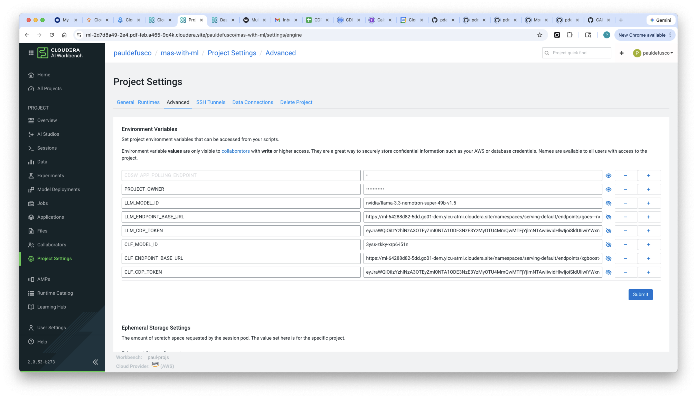
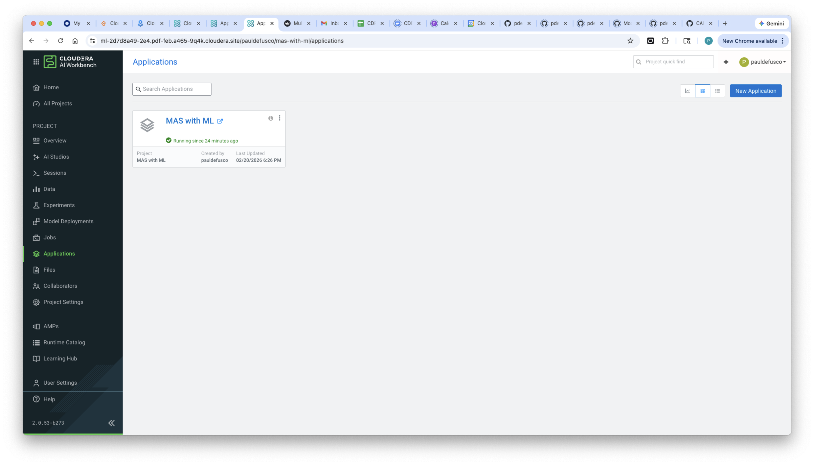
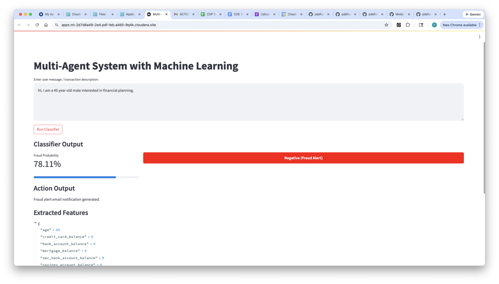
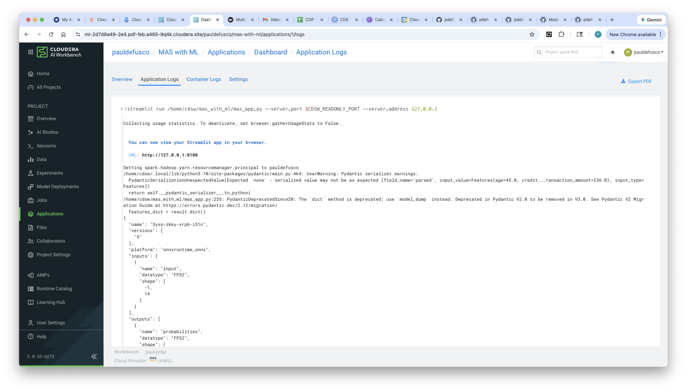
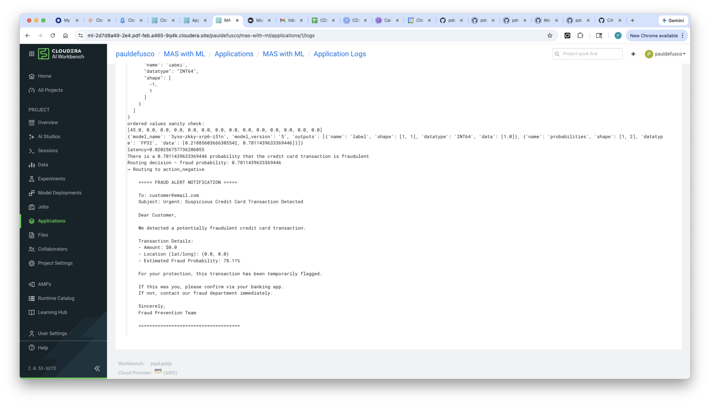
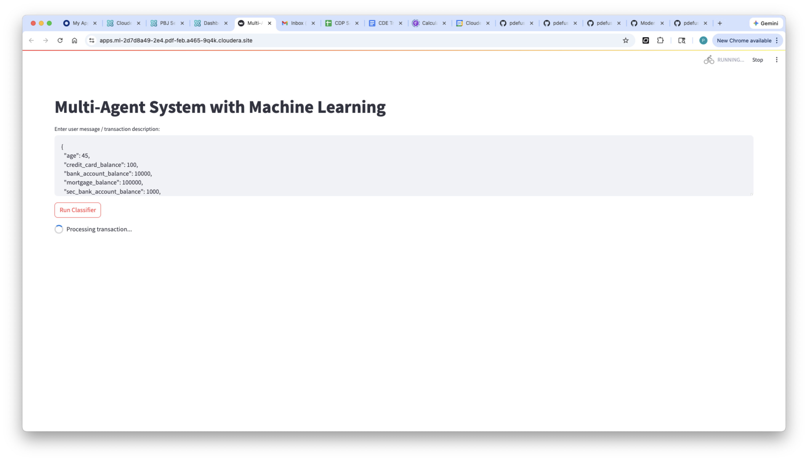
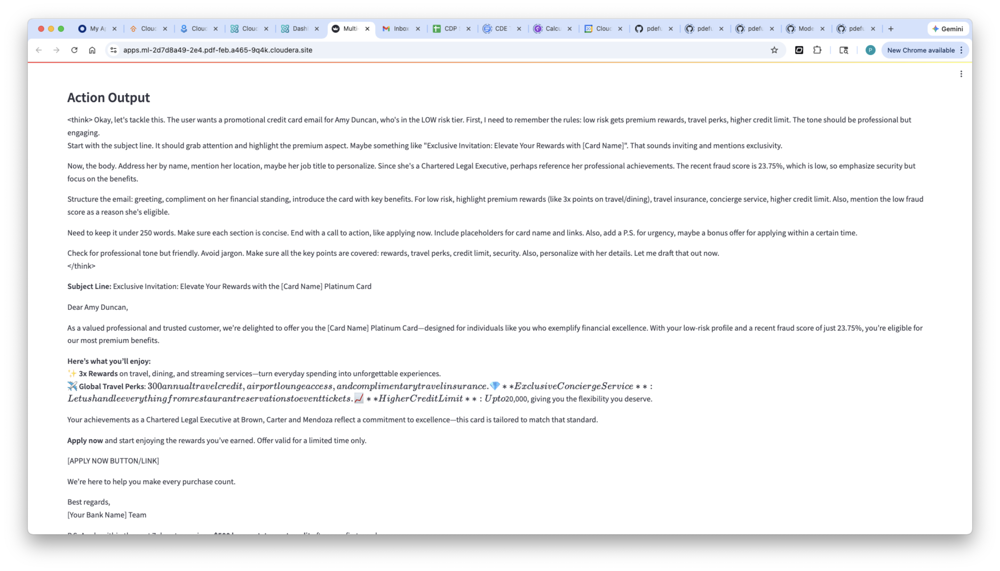
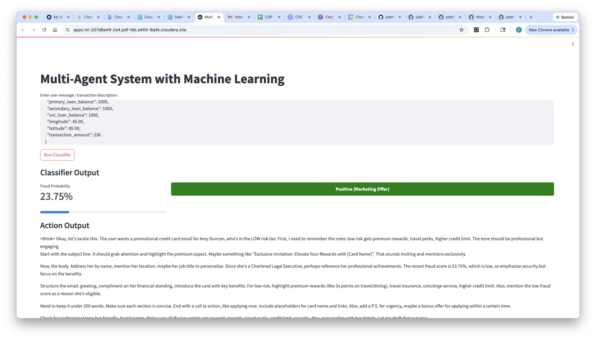
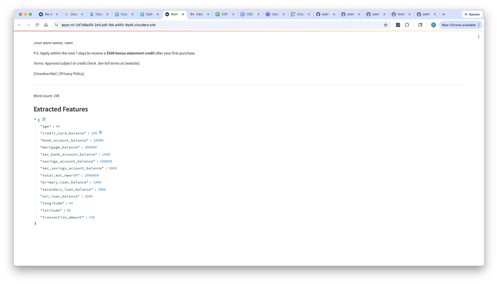

# How to Implement a Multi-Agent System with Machine Learning in Cloudera AI using Spark, XGBoost, LangGraph, Nemotron and Cloudera AI Inference Service, across Multiple Cloud Environments


## Objective

In this tutorial, you will implement a Multi-Agent System leveraging a Machine Learning for request routing and processing. The MAS will accept structured or unstructured text requests, extract features, and poll an XGBoost classifier in order to decide if the incoming request is anomalous. If it is, the MAS is tasked with sending a notification. If it's not, the MAS tasks a specialized agent to retrieve PII from a customer table in the Lakehouse and create a marketing offer for the customer.

### Motivation

With Cloudera AI, enterprises can download open source GenAI models and securely host them in their Public or Private Cloud, in order to implement LLM-powered applications while preventing proprietary information from being shared with LLM Service Providers such as OpenAI. Cloudera AI Inference Service is available both in Private and Public Clouds and can host both LLM as well as Machine Learning model endpoints. CAI deployments can be combined across clouds to provide secure, curated access to sensitive datasets through model endpoints.  

This tutorial can serve as a reusable template to build Multi-Agent Systems that leverage Machine Learning models across environments in order to route and process incoming user or system requests.

### Cloudera AI & LLM's

Cloudera AI (CAI) is a platform that enables organizations to build, train, and deploy machine learning and artificial intelligence models at scale. One of its key features is the Cloudera AI Inference Service, which allows users to easily deploy large language models (LLMs) for real-time or batch inference. With Cloudera AI, data scientists and engineers can manage and serve LLMs like Llama, Mistral, or open-source GPT models using containerized environments and scalable infrastructure. This service supports secure, low-latency model serving, making it easier to integrate AI into enterprise applications.

## Requirements

This example was built with Cloudera On Cloud Public Cloud Runtime 7.3.1, CAI Workbench 2.0.53, Inference Service 1.8.0 and AI Registry 1.11.0. In the Inference Service, an XGBoost and Nvidia Nemotron Super 49B endpoints were deployed ahead of time.

This tutorial does not show how to deploy the two models. If you're looking for steps to do so, please visit [this repository](https://github.com/pdefusco/CAI_Inf_Service_Articles/tree/main) to follow instructions to deploy the [XGBoost](https://github.com/pdefusco/CAI_Inf_Service_Articles/tree/main/xgboost) endpoint and the [Nemotron](https://github.com/pdefusco/CAI_Inf_Service_Articles/tree/main/mixtral-ngc) endpoints.

You can reproduce this tutorial in your CAI environment with the following:

* A CAI Environment in Private or Public Cloud.
* An AI Registry deployment.
* An AI Inference Service deployment with Nemotron (or another LLM) and XGBoost (or another Classifier model) deployed as two different endpoints. While any other LLM would work, the classifier needs to be trained with the same dataset shown here, so following [these steps](https://github.com/pdefusco/CAI_Inf_Service_Articles/tree/main/xgboost) to set up an XGBoost endpoint is highly recommended.

## Useful Documentation Links

* How to deploy a Workbench in Cloudera AI: https://docs.cloudera.com/machine-learning/1.5.5/workspaces-privatecloud/topics/ml-pvc-provision-ml-workspace.html
* How to deploy an AI Registry in Cloudera AI: https://docs.cloudera.com/machine-learning/1.5.5/setup-model-registry/topics/ml-setting-up-model-registry.html
* How to deploy an AI Inference Service in Cloudera AI: https://docs.cloudera.com/machine-learning/1.5.5/setup-cloudera-ai-inference/topics/ml-caii-use-caii.html

### Tutorial

All artifacts are included in this Git repository. You can clone or fork it as needed. https://github.com/pdefusco/cai_langgraph_agents_articles.git

#### 1. Clone the Git Repository as a CAI Project

Create a project with the following entries:

```
Project Name: MAS with Machine Learning
Project Description: Project to implement a Multi-Agent System leveraging ML for Decision Making.
Initial Setup: -> GIT -> HTTPS -> https://github.com/pdefusco/cai_langgraph_agents_articles.git
Runtimes:
  PBJ Workbench	Python 3.10	Standard 2025.09 or more recent
```

#### 2. Create the Project Environment Variables with Secrets

Navigate to the AI Inference Service UI and open the model endpoint. Then, copy the Model ID, Endpoint URL and CDP Token to your clipboard.

In the CAI Project Settings, create the following Environment Variables using the values copied above.

```
CLF_MODEL_ID: Enter the Model ID for XGBoost from the Inference Service UI
CLF_ENDPOINT_BASE_URL: Enter the Endpoint URL for XGBoost from the Inference Service UI
CLF_CDP_TOKEN: Enter the CDP Token for XGBoost from the Inference Service UI
LLM_MODEL_ID: Enter the Model ID for Nemotron from the Inference Service UI
LLM_ENDPOINT_BASE_URL: Enter the Endpoint URL for Nemotron from the Inference Service UI
LLM_CDP_TOKEN: Enter the CDP Token for Nemotron from the Inference Service UI
```



#### 3. Launch a CAI Session and Run the Script to Create PII Hive External Table

Launch your first CAI Session with PBJ Runtime. You won't need a lot of resources:

```
Kernel: PBJ Workbench	Python 3.10	Standard 2025.09 or more recent
Spark Runtime Addon: Spark 3.5.1
Resource Profile: 2 vCPU / 8 iGB Mem / 0 GPU
```

First, install the requirements by opening the Terminal and running this command:

```
pip3 install -r mas_with_ml/requirements.txt
```

Open ```pii_datagen.py``` and run it without modifications. This script will create a table called "customers" in a PII database.

Once the script has finished running you can shut down the session.

#### 4. Create the LangGraph App

Navigate to the Applications page and create a new Application using the following configurations.

```
Name: MAS with ML
Subdomain: apps
Script: mas_with_ml:launch_app.py
Editor: PBJ Workbench
Kernel: Python 3.10
Edition: Standard
Enable Spark: 3.5 or above
Resource Profile: 4 vCPU / 16 GiB / 0 GPU
```



#### Anomalous Request Test

Open the UI and run the first request using the default question populated in the chat: "Hi, I'm a 45 year old male interested in financial planning".

The request is found to be anomalous. Open the backend application logs and notice agent processing is shut down after an email notification is generated.







#### Approved Request Test

Using the app UI, input a new request with the following payload:

```
{
  "age": 45,
  "credit_card_balance": 100,
  "bank_account_balance": 10000,
  "mortgage_balance": 100000,
  "sec_bank_account_balance": 1000,
  "savings_account_balance": 100000,
  "sec_savings_account_balance": 1000,
  "total_est_nworth": 1000000,
  "primary_loan_balance": 1000,
  "secondary_loan_balance": 1000,
  "uni_loan_balance": 1000,
  "longitude": 45.00,
  "latitude": 85.00,
  "transaction_amount": 236
}
```

Behind the scenes, the MAS will poll the XGBoost endpoint and receive a response with a probability of anomaly below the arbitrary threshold of 50%. Therefore, it will continue processing the request by querying the Lakehouse table where customer PII data is stored, and craft a marketing message according to a risk assessment attribute found in the table.









## Summary & Next Steps

This demo consisted of a Multi-Agent System leveraging a Machine Learning classifier to process and route incoming requests. The prototype can be extended in many ways, including more comprehensive guardrails, more ML model decision nodes, more Lakehouse data sources across different environments and clouds. You built this in Cloudera AI leveraging XGboost, Nvidia Nemotron 49B, LangGraph, and the Cloudera AI Inference Service.

**Additional Resources & Tutorials**

Explore these helpful tutorials and blogs to learn more about Cloudera AI, the AI Registry, and AI Inference Service:

1. **Cloudera AI Inference Service – Easy Integration & Deployment**
   A technical deep dive into how Cloudera’s inference service enables GenAI integration in production: ([Reddit][1], [Cloudera][2])

2. **Deploy & Scale AI Applications with Cloudera AI Inference Service**
   Official Cloudera blog covering general availability, hybrid support, and GPU acceleration: ([Cloudera][3])

3. **Cloudera Introduces AI Inference Service With NVIDIA NIM**
   Explains how NVIDIA NIM microservices are embedded, + details on AI Registry integration: ([Cloudera][4])

4. **Scaling AI Solutions with Cloudera: Inference & Solution Patterns**
   A deep technical walkthrough on deploying AI at scale, including RAG workflows with LLaMA models: ([Cloudera][5], [Reddit][6])

5. **How to Use Model Registry on Cloudera Machine Learning**
   Community guide focused specifically on registering, versioning, and managing models: ([community.cloudera.com][7])

6. **Cloudera AI Inference Service Overview (docs)**
   Official documentation outlining architecture, APIs (OpenAI & standard protocols), GPU support, and registry integration: ([Cloudera][2])

[1]: https://www.reddit.com/r/LlamaIndex/comments/1f4nqvc?utm_source=chatgpt.com "[Tutorial] Building Multi AI Agent System Using LlamaIndex and Crew AI!"
[2]: https://www.cloudera.com/blog/technical/cloudera-ai-inference-service-enables-easy-integration-and-deployment-of-genai.html?utm_source=chatgpt.com "Elevating Productivity: Cloudera Data Engineering Brings External IDE Connectivity to Apache Spark | Blog | Cloudera"
[3]: https://www.cloudera.com/blog/business/deploy-and-scale-ai-applications-with-cloudera-ai-inference-service.html?utm_source=chatgpt.com "Deploy and Scale AI Applications With Cloudera AI Inference Service | Blog | Cloudera"
[4]: https://cloudera.com/blog/business/cloudera-introduces-ai-inference-service-with-nvidia-nim.html?utm_source=chatgpt.com "Cloudera Introduces AI Inference Service With NVIDIA NIM | Blog | Cloudera"
[5]: https://www.cloudera.com/blog/technical/scaling-ai-solutions-with-cloudera-a-deep-dive-into-ai-inference-and-solution-patterns.html?utm_source=chatgpt.com "Scaling AI Solutions with Cloudera: A Deep Dive into AI Inference and Solution Patterns | Blog | Cloudera"
[6]: https://www.reddit.com/r/learnmachinelearning/comments/1cn1c3u?utm_source=chatgpt.com "Fine-tune your first large language model (LLM) with LoRA, llama.cpp, and KitOps in 5 easy steps"
[7]: https://community.cloudera.com/t5/Community-Articles/How-to-use-Model-Registry-on-Cloudera-Machine-Learning/ta-p/379812?utm_source=chatgpt.com "How to use Model Registry on Cloudera Machine Lear... - Cloudera Community - 379812"
