# How to Implement a Spark Continuous Monitoring MultiAgent System in CAI with Chroma, Nvidia Nemotron 49B, Retrieval QA E5, Cloudera AI Inference Service and LangGraph


## Objective

In this tutorial, you will implement a MultiAgent System to continuously monitor Spark pipelines, flag performance anomalies, query internal documentation, playbooks and best practices, and output a moderated tuning recommendation. You will build this in Cloudera AI leveraging Chroma, Nvidia Nemotron 49B, Retrieval QA E5, LangGraph, and the Cloudera AI Inference Service.

This tutorial can serve as a reusable template to build MultiAgent Systems that autonomously poll internal or external system and process the information against internal knowledge sources to recommend a best course of action.

### Motivation

With Cloudera AI, enterprises can download open source GenAI models and securely host them in their Public or Private Cloud, in order to implement LLM-powered applications while preventing proprietary information from being shared with LLM Service Providers such as OpenAI.

### Cloudera AI & LLM's

Cloudera AI (CAI) is a platform that enables organizations to build, train, and deploy machine learning and artificial intelligence models at scale. One of its key features is the Cloudera AI Inference Service, which allows users to easily deploy large language models (LLMs) for real-time or batch inference. With Cloudera AI, data scientists and engineers can manage and serve LLMs like Llama, Mistral, or open-source GPT models using containerized environments and scalable infrastructure. This service supports secure, low-latency model serving, making it easier to integrate AI into enterprise applications.

## Requirements

This example was built with Cloudera On Cloud Public Cloud Runtime 7.3.1, CAI Workbench 2.0.53, Inference Service 1.8.0 and AI Registry 1.11.0. In the Inference Service, Nvidia Nemotron Super 49B and Retrieval QA E5 Embedding Model were deployed ahead of time.

This tutorial does not show how to deploy them. If you're looking for steps to do so, please visit [this repository](https://github.com/pdefusco/CAI_Inf_Service_Articles/tree/main) where you can find examples based on [Nvidia NIMs](https://github.com/pdefusco/CAI_Inf_Service_Articles/tree/main/mixtral-ngc), [HuggingFace Catalog](https://github.com/pdefusco/CAI_Inf_Service_Articles/tree/main/llama-hf), and [LangGraph](https://github.com/pdefusco/CAI_Inf_Service_Articles/tree/main/langgraph-agent).

You can reproduce this tutorial in your CAI environment with the following:

* A CAI Environment in Private or Public Cloud.
* An AI Registry deployment.
* An AI Inference Service deployment with Nemotron (or another LLM) and Retrieval QA E5 (or another Embedding model) deployed as two different endpoints.

## Useful Documentation Links

* How to deploy a Workbench in Cloudera AI: https://docs.cloudera.com/machine-learning/1.5.5/workspaces-privatecloud/topics/ml-pvc-provision-ml-workspace.html
* How to deploy an AI Registry in Cloudera AI: https://docs.cloudera.com/machine-learning/1.5.5/setup-model-registry/topics/ml-setting-up-model-registry.html
* How to deploy an AI Inference Service in Cloudera AI: https://docs.cloudera.com/machine-learning/1.5.5/setup-cloudera-ai-inference/topics/ml-caii-use-caii.html

### Tutorial

All artifacts are included in this Git repository. You can clone or fork it as needed. https://github.com/pdefusco/cai_langgraph_agents_articles.git

#### 1. Clone the Git Repository as a CAI Project

Create a project with the following entries:

```
Project Name: Continuous Monitoring MultiAgent System
Project Description: Project to implement a MultiAgent System for Continuous Monitoring of Spark Pipeline.
Initial Setup: -> GIT -> HTTPS -> https://github.com/pdefusco/cai_langgraph_agents_articles.git
Runtimes:
  PBJ Workbench	Python 3.10	Standard 2025.09
```

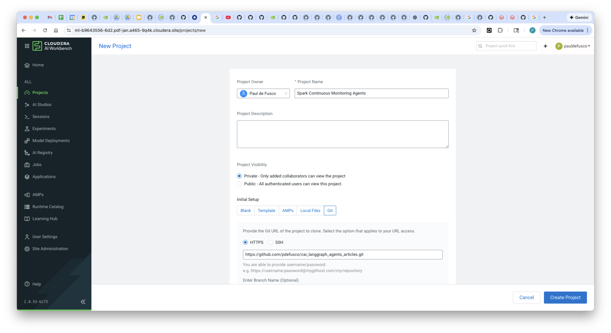

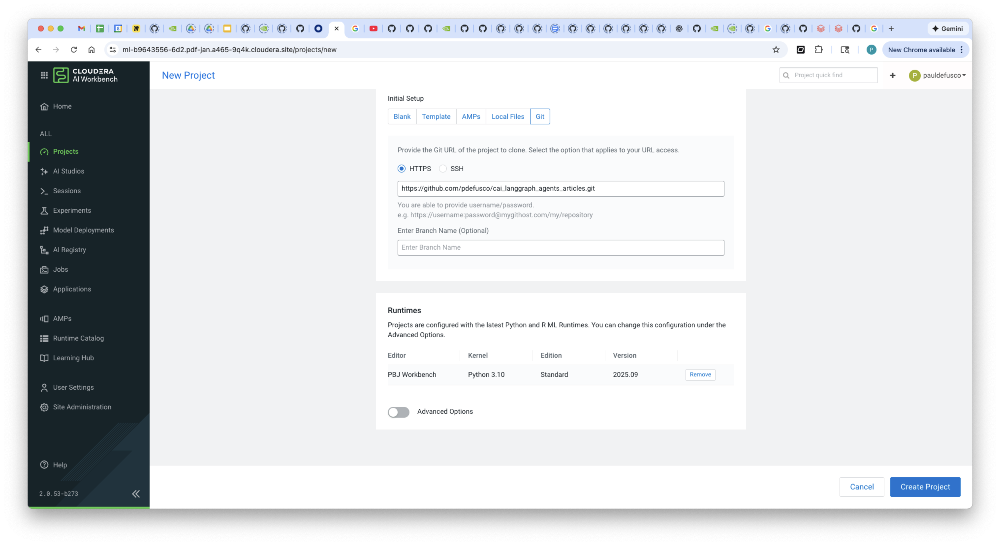

#### 2. Create the Project Environment Variables with Secrets

Navigate to the AI Inference Service UI and open the model endpoint. Then, copy the Model ID, Endpoint URL and CDP Token to your clipboard.

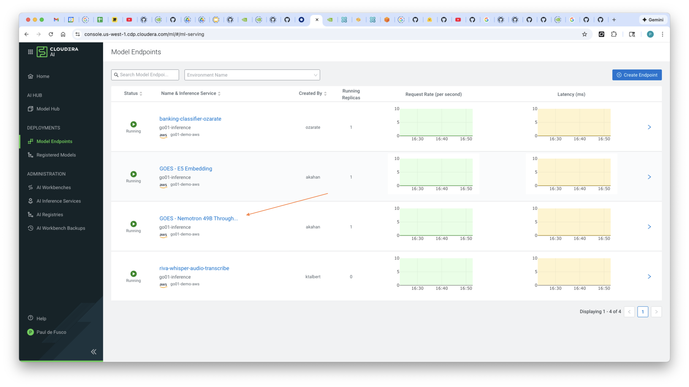


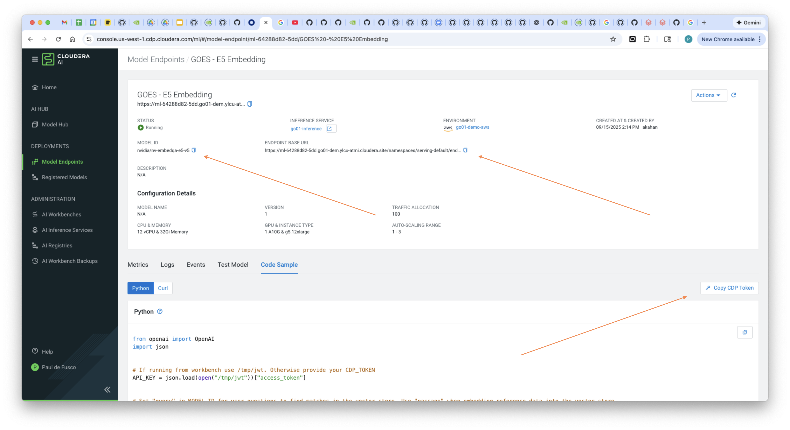

In the CAI Project Settings, create the following Environment Variables using the values copied above.

```
EMBEDDING_MODEL_ID: Enter the Model ID for Retrieval QA E5 from the Inference Service UI
EMBEDDING_ENDPOINT_BASE_URL: Enter the Endpoint URL for Retrieval QA E5 from the Inference Service UI
EMBEDDING_CDP_TOKEN: Enter the CDP Token for Retrieval QA E5 from the Inference Service UI
LLM_MODEL_ID: Enter the Model ID for Nemotron from the Inference Service UI
LLM_ENDPOINT_BASE_URL: Enter the Endpoint URL for Nemotron from the Inference Service UI
LLM_CDP_TOKEN: Enter the CDP Token for Nemotron from the Inference Service UI
```


#### 3. Launch a CAI Session and Run the Script to Create Spark Job Runs

Launch your first CAI Session with PBJ Runtime. You won't need a lot of resources:

```
Kernel: PBJ Workbench	Python 3.10	Standard 2025.09
Spark Runtime Addon: Spark 3.5.1
Resource Profile: 2 vCPU / 8 iGB Mem / 0 GPU
```

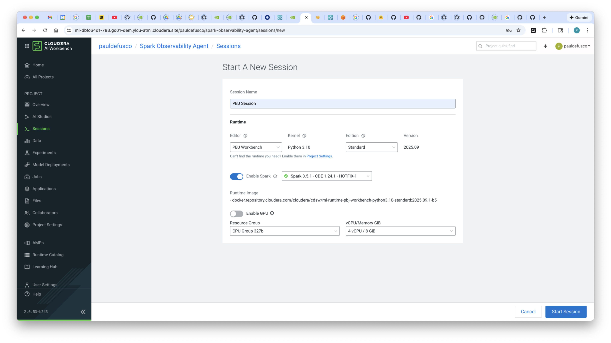

First, install the requirements by opening the Terminal and running this command:

```
pip3 install -r spark_continuous_monitoring_agent/requirements.txt
```

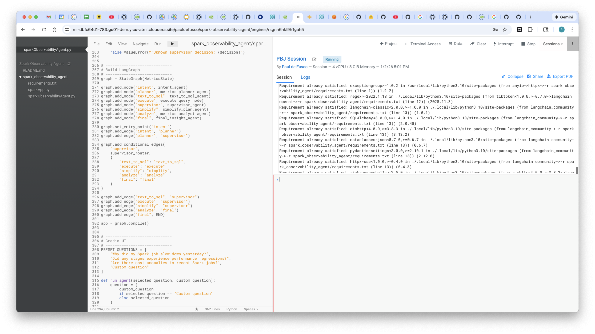

Open ```sparkApp.py``` and familiarize yourself with the code. Update the hadoopFileSystem variable at line 49 according to your data lake bucket. If you have trouble finding this value, contact your CDP Admin.

Run the script at least 10 times in order to populate the Hive External Table with Spark Metrics from each run. This will just take a few minutes.

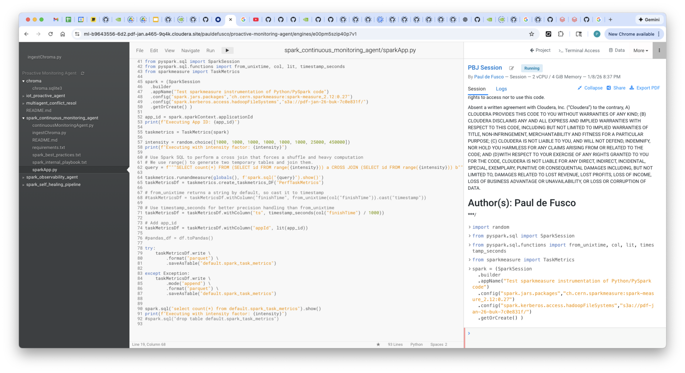

#### 4. Create and Populate the Chroma Vector Database

In the same session, run ```ingestChroma.py```. No code changes are required.


#### 5. Deploy the Gradio LangGraph Application

Navigate to Applications and launch the Gradio LangGraph App with the following settings.

```
Name: Continuous Spark Monitoring Agents
Kernel: PBJ Workbench	Python 3.10	Standard 2025.09
Spark Runtime Addon: Spark 3.5.1
Resource Profile: 2 vCPU / 8 iGB Mem / 0 GPU
Script: spark_continuous_monitoring_agent/continuousMonitoringAgent.py
```

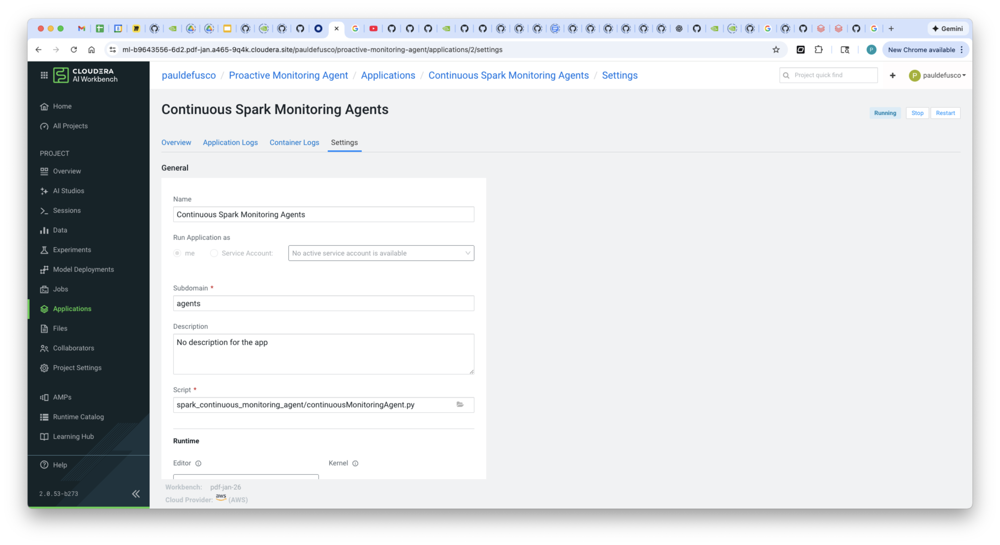

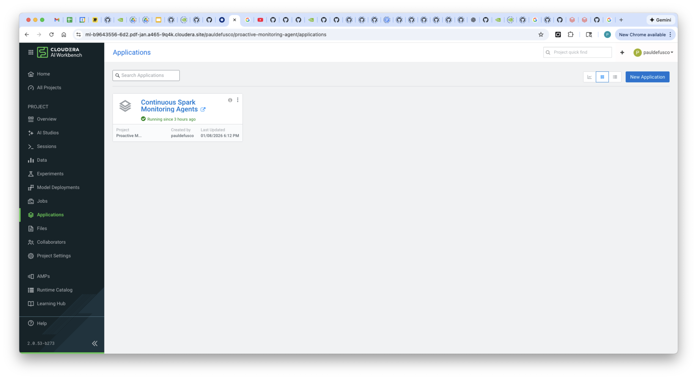

#### 6. Interact with the Agent App

Open the Application and wait a few seconds until the list of spark applications is output to the screen. In the main table all spark application runs are presented along with key performance metrics.

Directly below, applications with performance issues are flagged and a recommendation from the llm is presented. Notice that the recommendation is filtered by internal best practices and playbooks. This is where internal policies and recommendations are stored and consulted by the llm before outputting a final recommendation, in order to guard against potentially harmful tunings.

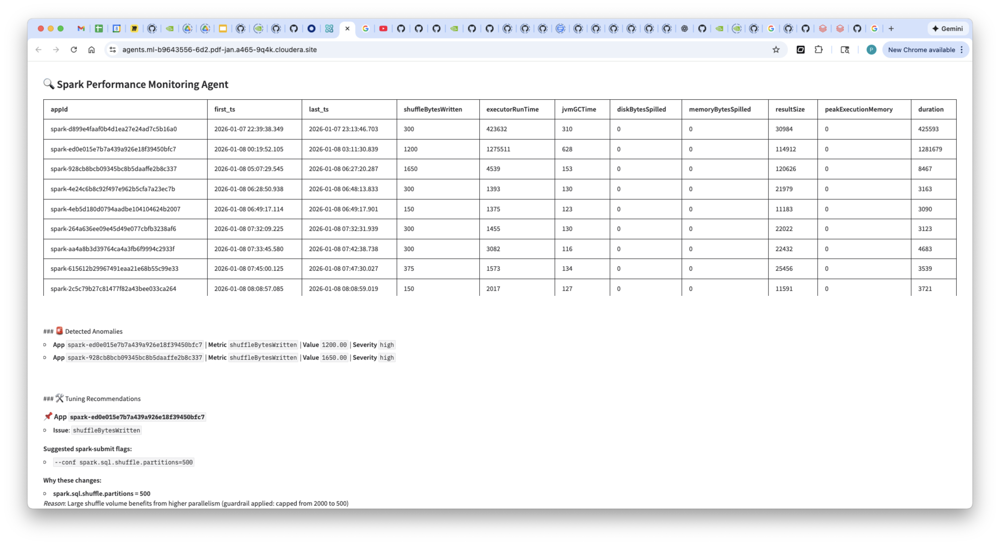

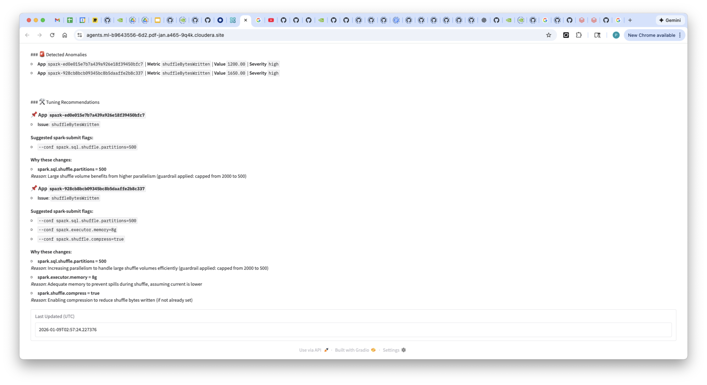


## Summary & Next Steps

In this tutorial, you implemented a MultiAgent System to continuously monitor Spark pipelines, flag performance anomalies, query internal documentation, playbooks and best practices, and output a moderated tuning recommendation. You built this in Cloudera AI leveraging Chroma, Nvidia Nemotron 49B, Retrieval QA E5, LangGraph, and the Cloudera AI Inference Service.

This tutorial can serve as a reusable template to build MultiAgent Systems that autonomously poll internal or external system and process the information against internal knowledge sources to recommend a best course of action.

**Additional Resources & Tutorials**
Explore these helpful tutorials and blogs to learn more about Cloudera AI, the AI Registry, and AI Inference Service:

1. **Cloudera AI Inference Service – Easy Integration & Deployment**
   A technical deep dive into how Cloudera’s inference service enables GenAI integration in production: ([Reddit][1], [Cloudera][2])

2. **Deploy & Scale AI Applications with Cloudera AI Inference Service**
   Official Cloudera blog covering general availability, hybrid support, and GPU acceleration: ([Cloudera][3])

3. **Cloudera Introduces AI Inference Service With NVIDIA NIM**
   Explains how NVIDIA NIM microservices are embedded, + details on AI Registry integration: ([Cloudera][4])

4. **Scaling AI Solutions with Cloudera: Inference & Solution Patterns**
   A deep technical walkthrough on deploying AI at scale, including RAG workflows with LLaMA models: ([Cloudera][5], [Reddit][6])

5. **How to Use Model Registry on Cloudera Machine Learning**
   Community guide focused specifically on registering, versioning, and managing models: ([community.cloudera.com][7])

6. **Cloudera AI Inference Service Overview (docs)**
   Official documentation outlining architecture, APIs (OpenAI & standard protocols), GPU support, and registry integration: ([Cloudera][2])

[1]: https://www.reddit.com/r/LlamaIndex/comments/1f4nqvc?utm_source=chatgpt.com "[Tutorial] Building Multi AI Agent System Using LlamaIndex and Crew AI!"
[2]: https://www.cloudera.com/blog/technical/cloudera-ai-inference-service-enables-easy-integration-and-deployment-of-genai.html?utm_source=chatgpt.com "Elevating Productivity: Cloudera Data Engineering Brings External IDE Connectivity to Apache Spark | Blog | Cloudera"
[3]: https://www.cloudera.com/blog/business/deploy-and-scale-ai-applications-with-cloudera-ai-inference-service.html?utm_source=chatgpt.com "Deploy and Scale AI Applications With Cloudera AI Inference Service | Blog | Cloudera"
[4]: https://cloudera.com/blog/business/cloudera-introduces-ai-inference-service-with-nvidia-nim.html?utm_source=chatgpt.com "Cloudera Introduces AI Inference Service With NVIDIA NIM | Blog | Cloudera"
[5]: https://www.cloudera.com/blog/technical/scaling-ai-solutions-with-cloudera-a-deep-dive-into-ai-inference-and-solution-patterns.html?utm_source=chatgpt.com "Scaling AI Solutions with Cloudera: A Deep Dive into AI Inference and Solution Patterns | Blog | Cloudera"
[6]: https://www.reddit.com/r/learnmachinelearning/comments/1cn1c3u?utm_source=chatgpt.com "Fine-tune your first large language model (LLM) with LoRA, llama.cpp, and KitOps in 5 easy steps"
[7]: https://community.cloudera.com/t5/Community-Articles/How-to-use-Model-Registry-on-Cloudera-Machine-Learning/ta-p/379812?utm_source=chatgpt.com "How to use Model Registry on Cloudera Machine Lear... - Cloudera Community - 379812"
