# How to Implement a CDE Spark Self Healing Pipeline in CAI with LangGraph, Nvidia Nemotron 49B, and Cloudera AI Inference Service

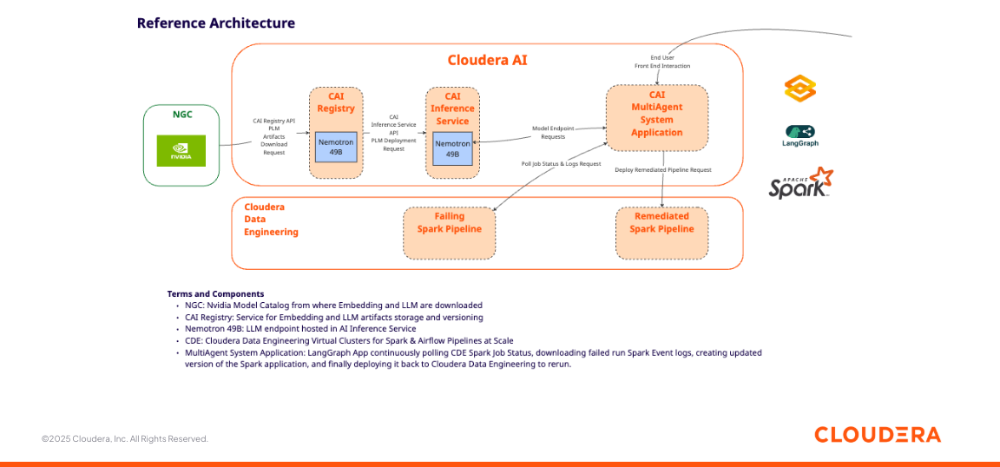

## Objective

In this tutorial, you will implement a MultiAgent System to continuously monitor a Spark Application running in Cloudera Data Engineering, correct any potential coding errors and finally create and run the updated version of the application. We will call this a "Self Healing Pipeline". You will build this MAS in Cloudera AI leveraging LangGraph, Nvidia Nemotron 49B, and the Cloudera AI Inference Service.

This tutorial can serve as a reusable template to build MultiAgent Systems that autonomously monitor and take corrective actions against data engineering pipelines.

### Motivation

With Cloudera AI, enterprises can download open source GenAI models and securely host them in their Public or Private Cloud, in order to implement LLM-powered applications while preventing proprietary information from being shared with LLM Service Providers such as OpenAI. We call this Private AI.

Cloudera customers are increasingly applying Private AI to manage and scale data engineering pipelines. LLM's are being leveraged to generate and optimize code, assist in monitoring live job runs, and analyze metrics and structured logs.

When failures occur, AI-driven analysis can quickly correlate error messages, stack traces, and performance signals with the underlying application code to identify root causes such as data skew, memory pressure, or schema mismatches.

This enables faster iteration and correction—whether by adjusting transformations, tuning configurations, or fixing logic errors—ultimately improving pipeline reliability, reducing downtime, and accelerating development cycles.

### Cloudera AI & LLM's

Cloudera AI (CAI) is a platform that enables organizations to build, train, and deploy machine learning and artificial intelligence models at scale. One of its key features is the Cloudera AI Inference Service, which allows users to easily deploy large language models (LLMs) for real-time or batch inference. With Cloudera AI, data scientists and engineers can manage and serve LLMs like Llama, Mistral, or open-source GPT models using containerized environments and scalable infrastructure. This service supports secure, low-latency model serving, making it easier to integrate AI into enterprise applications.

## Requirements

This example was built with Cloudera On Cloud Public Cloud Runtime 7.3.1, CAI Workbench 2.0.53, Inference Service 1.8.0 and AI Registry 1.11.0.

You can reproduce this tutorial in your CAI environment with the following:

* A CDE Service and Virtual Cluster in Private or Public Cloud.
* Preferably an installation of the CDE CLI. If you don't have the CLI you can create the CDE Spark Pipeline via the CDE UI.
* A CAI Environment in Private or Public Cloud.
* An AI Registry deployment.
* An AI Inference Service deployment with Nemotron (or another LLM) and Retrieval QA E5 (or another Embedding model) deployed as two different endpoints.

This tutorial does not includes instructions to deploy the AI Registry, Inference Service and Nemotron endpoint. For deployment examples, please visit [this repository](https://github.com/pdefusco/CAI_Inf_Service_Articles/tree/main) where you can find projects based on [Nvidia NIMs](https://github.com/pdefusco/CAI_Inf_Service_Articles/tree/main/mixtral-ngc), [HuggingFace Catalog](https://github.com/pdefusco/CAI_Inf_Service_Articles/tree/main/llama-hf), and [LangGraph](https://github.com/pdefusco/CAI_Inf_Service_Articles/tree/main/langgraph-agent).

## Useful Documentation Links

* How to deploy a Workbench in Cloudera AI: https://docs.cloudera.com/machine-learning/1.5.5/workspaces-privatecloud/topics/ml-pvc-provision-ml-workspace.html
* How to deploy an AI Registry in Cloudera AI: https://docs.cloudera.com/machine-learning/1.5.5/setup-model-registry/topics/ml-setting-up-model-registry.html
* How to deploy an AI Inference Service in Cloudera AI: https://docs.cloudera.com/machine-learning/1.5.5/setup-cloudera-ai-inference/topics/ml-caii-use-caii.html

### Tutorial

All artifacts are included in this Git repository. You can clone or fork it as needed. https://github.com/pdefusco/cai_langgraph_agents_articles.git

#### 1. Clone the Git Repository as a CAI Project

Create a project with the following entries:

```
Project Name: MultiAgent System for Spark Self Healing Pipeline
Project Description: Project to implement a MultiAgent System to Monitor and Heal Spark Pipeline.
Initial Setup: -> GIT -> HTTPS -> https://github.com/pdefusco/cai_langgraph_agents_articles.git
Runtimes:
  PBJ Workbench	Python 3.10	Standard 2025.09
```

#### 2. Create the Project Environment Variables with Secrets

Navigate to the AI Inference Service UI and open the model endpoint. Then, copy the Model ID, Endpoint URL and CDP Token to your clipboard.

In the CAI Project Settings, create the following Environment Variables using the values copied above.

```
LLM_MODEL_ID: Enter the Model ID for Nemotron from the Inference Service UI
LLM_ENDPOINT_BASE_URL: Enter the Endpoint URL for Nemotron from the Inference Service UI
LLM_CDP_TOKEN: Enter the CDP Token for Nemotron from the Inference Service UI
```

#### 3. Create and Launch the CDE Spark Pipeline

Open ```sparkApp.py``` and familiarize yourself with the code. This is a Spark Iceberg application that incrementally generates synthetic data batches and upserts them into a target table using the Iceberg Merge Into. Notice at lines 19-22 the table names are assigned a wrong name. This will be the source of the error.

```
spark.sql(f"""
    SELECT customer_id, category, value1, value2
    FROM {targetTable}
    """).show()
```

Next, using the CDE CLI, run the following commands to set up all dependencies required for the Spark Pipeline in CDE.

```
cde resource create \
  --name failing-pipeline

cde resource create \
  --name datagen-env \
  --type python-env

cde resource upload \
  --name datagen-env \
  --local-path cde_dependencies/requirements.txt

cde resource upload \
  --name failing-pipeline \
  --local-path sparkApp.py \
  --local-path datagen.py
```

Wait for the python environment build to complete. Then create the Incremental Read job.


Create and run the datagen job.

```
cde job delete \
  --name datagen

cde job create \
  --name datagen \
  --type spark \
  --application-file datagen.py \
  --python-env-resource-name datagen-env \
  --mount-1-resource failing-pipeline \
  --executor-cores 4 \
  --executor-memory "8g" \
  --driver-cores 4 \
  --driver-memory "4g" \
  --arg spark_catalog.default.dynamic_incremental_target_table_large_overlap \
  --arg spark_catalog.default.dynamic_incremental_source_table_large_overlap \
  --conf spark.dynamicAllocation.minExecutors=1 \
  --conf spark.dynamicAllocation.maxExecutors=20 \
  --conf spark.sql.adaptive.enabled=False

cde job run \
  --name datagen
```

Once the datagen job has succeeded, create and run the failing-pipeline job.

```
cde job delete \
  --name sql-select-fail

cde job create \
  --name sql-select-fail \
  --type spark \
  --application-file sparkApp.py \
  --python-env-resource-name datagen-env \
  --mount-1-resource failing-pipeline \
  --executor-cores 4 \
  --executor-memory "8g" \
  --driver-cores 4 \
  --driver-memory "4g" \
  --arg spark_catalog.default.dynamic_incremental_target_table_large_overlap \
  --arg spark_catalog.default.dynamic_incremental_source_table_large_overlap \
  --conf spark.dynamicAllocation.minExecutors=1 \
  --conf spark.dynamicAllocation.maxExecutors=20

cde job run \
  --name sql-select-fail
```

Visit the CDE Job Runs UI, wait for the job run finish running and confirm it fails. Open the logs tab and investigate the cause of failure.


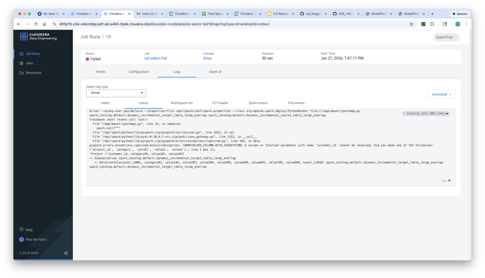

#### 4. Launch a CAI Session and Install Requirements for the MAS

Launch your first CAI Session with PBJ Runtime. You won't need a lot of resources:

```
Kernel: PBJ Workbench	Python 3.10	Standard 2025.09
Spark Runtime Addon: Spark 3.5.1
Resource Profile: 2 vCPU / 8 iGB Mem / 0 GPU
```

First, install the requirements by opening the Terminal and running this command:

```
pip3 install -r spark_self_healing_pipeline_simple/requirements.txt
```

#### 5. Set Project Environment Variables

The LangGraph application will rely on a few environment variables to connect to CDE and the LLM endpoint. To set these, open the "Project Settings" -> "Advanced" tabs and set the following variables:

```
JOBS_API_URL: Obtain from the CDE UI
WORKLOAD_USER: Your CDP Username
WORKLOAD_PASSWORD: Your CDP User Password

JOB_NAME: sql-select-fail
RESOURCE_NAME: failing-pipeline
APPLICATION_FILE_NAME: sparkApp.py

LLM_MODEL_ID: Obtain from the Model Endpoint UI in the AI Inference Service
LLM_ENDPOINT_BASE_URL: Obtain from the Model Endpoint UI in the AI Inference Service
LLM_CDP_TOKEN: Obtain from the Model Endpoint UI in the AI Inference Service
```

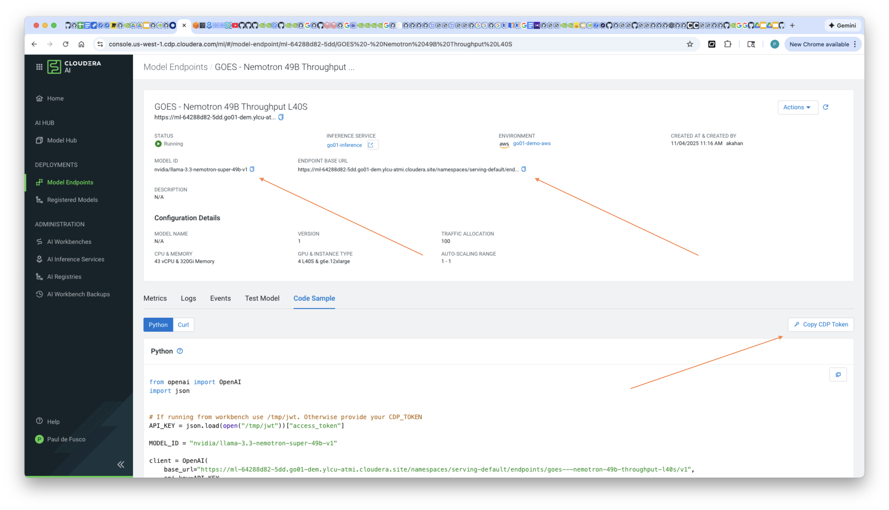

Your environment variables tab should look something like this:

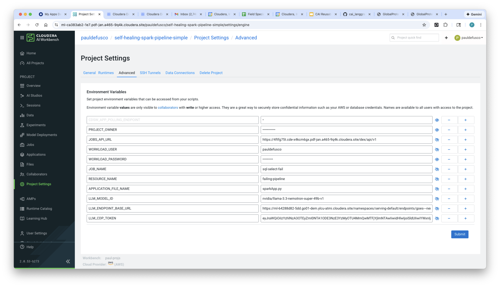

#### 6. Deploy the Gradio LangGraph MAS as a CAI Application

Navigate to Applications and launch the Gradio LangGraph App with the following settings.

```
Name: Continuous Spark Monitoring Agents
Kernel: PBJ Workbench	Python 3.10	Standard 2025.09
Spark Runtime Addon: Spark 3.5.1
Resource Profile: 2 vCPU / 8 iGB Mem / 0 GPU
Script: spark_self_healing_pipeline_simple/selfHealingPipeline.py
```

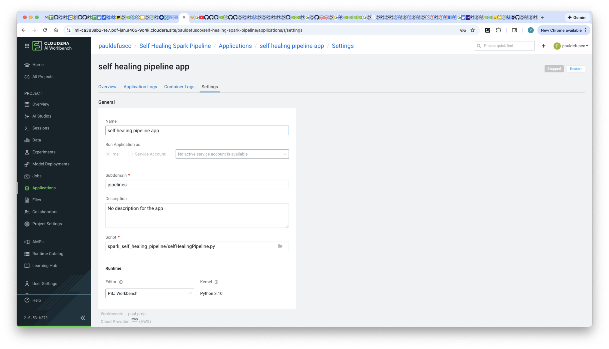

Validate the applicaton has deployed successfully.

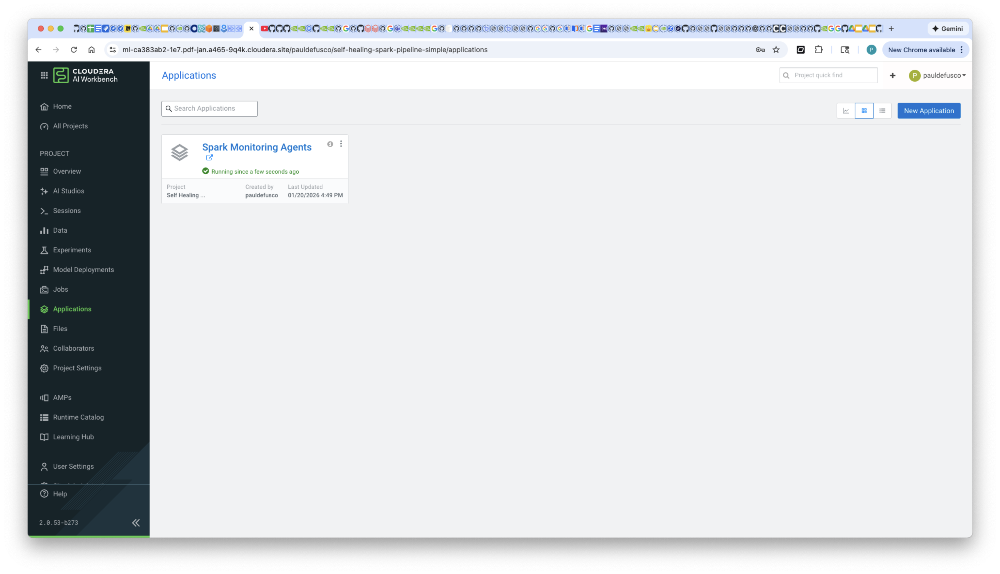

#### 7. Interact with the Agent App

Open the Application and wait a few seconds until the UI is populated.

At the top, the UI provides information about the original and fixed job including name, dependencies, and confirmation of the new run with the fixed code.

Towards the middle, the original application code is provided on the left and the remediated application code is shown on the right. Notice the fix is applied at line 21 by replacing the customer_id field with the account_id field in the SQL Select.

Finally, at the bottom, the Driver stdout logs from the original application are shown in the box in the left. In the center, the LLM reasoning steps are shown. On the right, a diff between the two application scripts is presented.

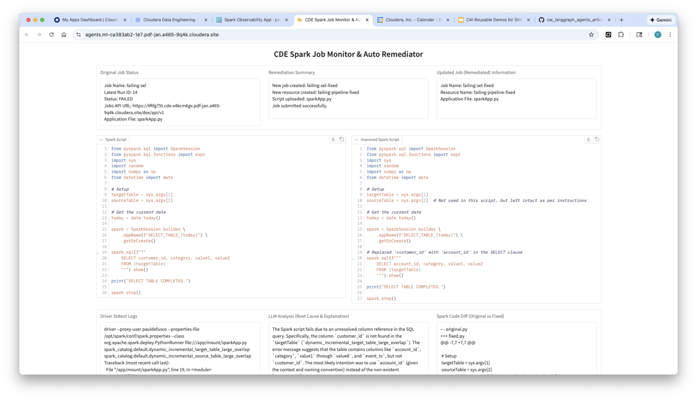

Open the Application History logs to follow along the LangGraph execution.  

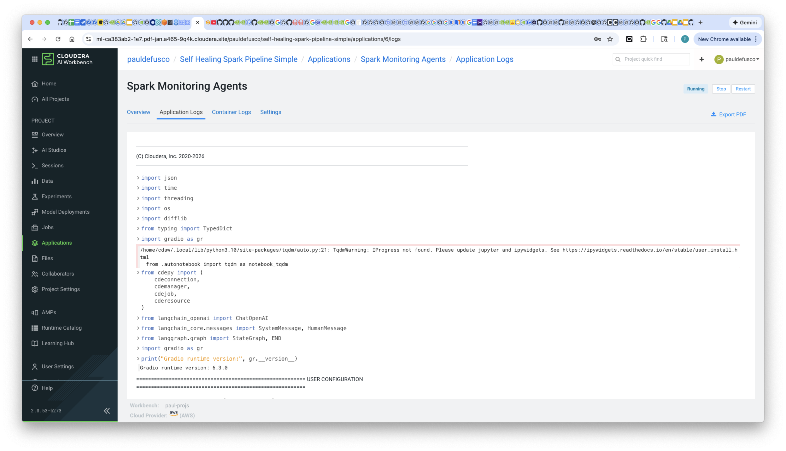

Navigate to the CDE UI, validate the new Spark Job definition, its dependencies, and a follow the new run's progress.

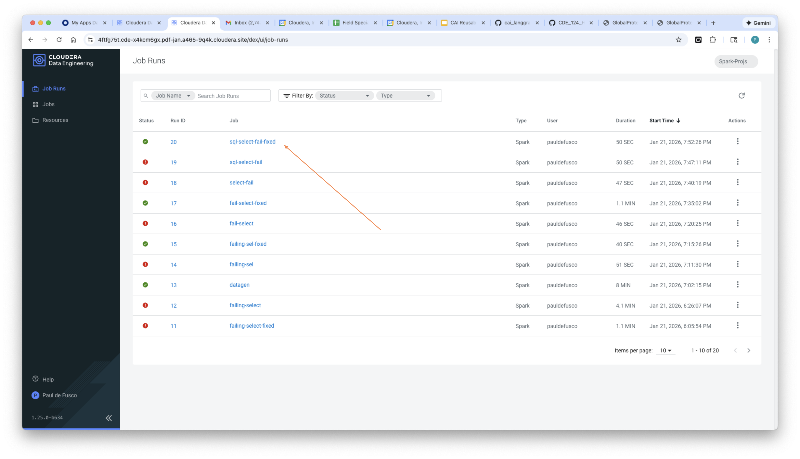

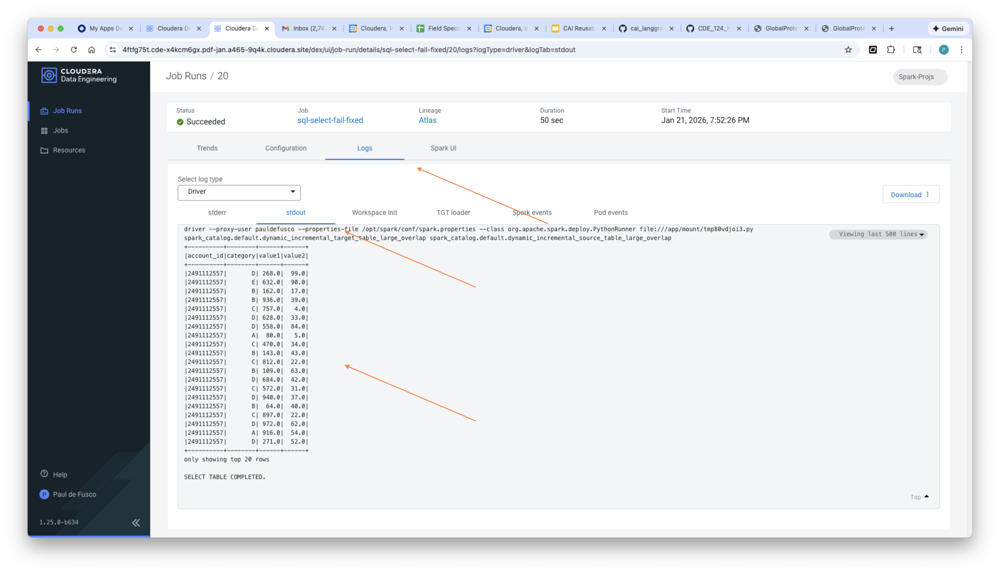


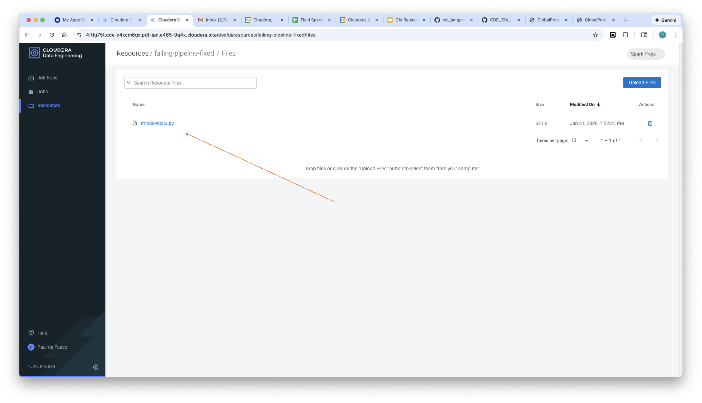


## Summary & Next Steps

In this tutorial, you implemented a MultiAgent System to monitor the status of a Spark application in Cloudera Data Engineering (CDE), have an LLM analyze the code and related logs, create a new version of the application code, and recreate and run the new code in CDE. We call this a "Self Healing Pipeline".

You built this in Cloudera AI leveraging an Nvidia Nemotron 49B endpoint, LangGraph, and the Cloudera AI Inference Service. This tutorial can serve as a reusable template to build MultiAgent Systems that autonomously monitor and fix errors in data engineering pipelines.

**Additional Resources & Tutorials**
Explore these helpful tutorials and blogs to learn more about Cloudera AI, the AI Registry, and AI Inference Service:

1. **Cloudera AI Inference Service – Easy Integration & Deployment**
   A technical deep dive into how Cloudera’s inference service enables GenAI integration in production: ([Reddit][1], [Cloudera][2])

2. **Deploy & Scale AI Applications with Cloudera AI Inference Service**
   Official Cloudera blog covering general availability, hybrid support, and GPU acceleration: ([Cloudera][3])

3. **Cloudera Introduces AI Inference Service With NVIDIA NIM**
   Explains how NVIDIA NIM microservices are embedded, + details on AI Registry integration: ([Cloudera][4])

4. **Scaling AI Solutions with Cloudera: Inference & Solution Patterns**
   A deep technical walkthrough on deploying AI at scale, including RAG workflows with LLaMA models: ([Cloudera][5], [Reddit][6])

5. **How to Use Model Registry on Cloudera Machine Learning**
   Community guide focused specifically on registering, versioning, and managing models: ([community.cloudera.com][7])

6. **Cloudera AI Inference Service Overview (docs)**
   Official documentation outlining architecture, APIs (OpenAI & standard protocols), GPU support, and registry integration: ([Cloudera][2])

[1]: https://www.reddit.com/r/LlamaIndex/comments/1f4nqvc?utm_source=chatgpt.com "[Tutorial] Building Multi AI Agent System Using LlamaIndex and Crew AI!"
[2]: https://www.cloudera.com/blog/technical/cloudera-ai-inference-service-enables-easy-integration-and-deployment-of-genai.html?utm_source=chatgpt.com "Elevating Productivity: Cloudera Data Engineering Brings External IDE Connectivity to Apache Spark | Blog | Cloudera"
[3]: https://www.cloudera.com/blog/business/deploy-and-scale-ai-applications-with-cloudera-ai-inference-service.html?utm_source=chatgpt.com "Deploy and Scale AI Applications With Cloudera AI Inference Service | Blog | Cloudera"
[4]: https://cloudera.com/blog/business/cloudera-introduces-ai-inference-service-with-nvidia-nim.html?utm_source=chatgpt.com "Cloudera Introduces AI Inference Service With NVIDIA NIM | Blog | Cloudera"
[5]: https://www.cloudera.com/blog/technical/scaling-ai-solutions-with-cloudera-a-deep-dive-into-ai-inference-and-solution-patterns.html?utm_source=chatgpt.com "Scaling AI Solutions with Cloudera: A Deep Dive into AI Inference and Solution Patterns | Blog | Cloudera"
[6]: https://www.reddit.com/r/learnmachinelearning/comments/1cn1c3u?utm_source=chatgpt.com "Fine-tune your first large language model (LLM) with LoRA, llama.cpp, and KitOps in 5 easy steps"
[7]: https://community.cloudera.com/t5/Community-Articles/How-to-use-Model-Registry-on-Cloudera-Machine-Learning/ta-p/379812?utm_source=chatgpt.com "How to use Model Registry on Cloudera Machine Lear... - Cloudera Community - 379812"
